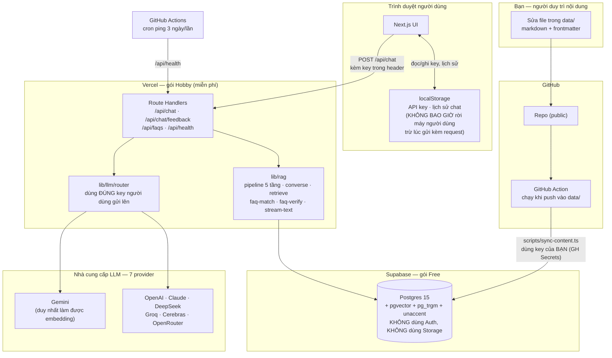

# 02 — Kiến trúc kỹ thuật

> **Đã đổi mô hình (04/08/2026):** bỏ hoàn toàn hệ thống tài khoản. Nội dung quản lý qua **Git** (không có trang admin web). Người dùng **bắt buộc** tự nhập API key riêng để dùng tính năng hỏi đáp AI — không có quota hệ thống. Xem lý do ở ADR-8, ADR-9.
> **Bổ sung (04/08/2026):** web là **PWA** (cài được vào màn hình chính, mở full-screen như app), giao diện tham chiếu ChatGPT/Gemini. Xem mục 9. **Không** cần tài khoản để "nhớ" API key — `localStorage` đã tự làm việc đó vĩnh viễn (ADR-12), nên không có gì phải đổi ở tầng auth.

---

## 1. Sơ đồ tổng thể



**Điểm khác biệt cốt lõi so với thiết kế ban đầu:** không còn "hệ thống gọi LLM bằng ngân sách chung". Mọi lời gọi LLM ở thời điểm hỏi đáp đều dùng **key của chính người đang hỏi**, key đó không bao giờ chạm tới database — chỉ đi qua bộ nhớ của route handler trong đúng một request rồi biến mất.

---

## 2. Lựa chọn stack và lý do

| Lớp | Chọn | Vì sao |
|---|---|---|
| Framework | **Next.js 15 App Router** | Một codebase cho cả frontend và backend | 
| Ngôn ngữ | **TypeScript strict** | |
| UI | **Tailwind + shadcn/ui** | |
| Hosting | **Vercel Hobby** | |
| Database | **Supabase Postgres + pgvector** | Chỉ dùng phần Postgres. **Không dùng Supabase Auth, không dùng Supabase Storage** — không còn tài khoản để quản lý, không còn ảnh cần lưu ở server (xem ADR-11) |
| Quản lý nội dung | **Git (thư mục `data/`)** | Thay cho trang admin web. Nội dung công khai, không nhạy cảm → không cần lớp xác thực để bảo vệ nó (ADR-8) |
| Đồng bộ nội dung | **GitHub Action + script Node** | Push vào `data/` → tự động cắt chunk, tạo embedding, ghi vào Supabase. Không cần app đang chạy, không cần endpoint ghi công khai |
| Vector store | **pgvector trong cùng Postgres** | |
| Tìm kiếm từ khoá | **Postgres FTS + pg_trgm + unaccent** | Vẫn là lớp dự phòng khi embedding lỗi |
| LLM | **Router dùng key người dùng cung cấp** | BYOK là cơ chế **duy nhất**, không phải tính năng phụ (ADR-9) |
| PWA | ✅ Viết tay `manifest.json` + `sw.js` tối giản (**không** dùng `next-pwa` như dự kiến ban đầu — xem 🚧 mục 9) | Cài được vào màn hình chính, mở full-screen. Chỉ cache **app shell** (JS/CSS/icon), không cache API response (ADR-14) |
| Chặn spam theo IP | 🚧 **CHƯA TRIỂN KHAI** — dự kiến Upstash Redis (free tier) + `@upstash/ratelimit` | `/api/chat` chạy trên Vercel serverless — **không có bộ nhớ chung giữa các lần gọi**, một bộ đếm `Map` trong RAM sẽ không hoạt động thật. Cần store bên ngoài (ADR-15). *Hiện `/api/chat` chưa có giới hạn tần suất nào ngoài guardrail độ dài câu hỏi* |

### Vì sao bỏ Supabase Auth

Không còn khái niệm "tài khoản" nào trong hệ thống — không admin, không student. Nội dung khóa học công khai, không có gì cần bảo vệ bằng đăng nhập. Giữ Auth lại chỉ để "phòng khi cần" là thêm một lớp phức tạp (RLS theo `auth.uid()`, cookie, session, trang login) phục vụ cho một nhu cầu không tồn tại.

### Vì sao bỏ Supabase Storage

Ảnh dùng để OCR chỉ tồn tại **trên máy bạn**, trong lúc soạn nội dung (xem F08 mới ở `05-FEATURES.md`). Kết quả cuối cùng commit vào repo là **markdown**, không phải ảnh. Muốn giữ ảnh gốc để đối chiếu sau này thì tự commit nó vào `data/` cùng thư mục — Git xử lý được vài chục ảnh nhỏ mà không cần thêm dịch vụ.

---

## 3. Cấu trúc thư mục

```
data/                                  ← NGUỒN SỰ THẬT của nội dung, bạn sửa trực tiếp
├── config.yaml                        # Cấu hình hệ thống — xem 03-DATA-MODEL.md
├── categories.yaml                    # Danh sách danh mục
├── documents/
│   ├── lich-hoc/
│   │   └── thoi-khoa-bieu-hk1.md      # Frontmatter: title, category, tags, status
│   ├── bai-tap/
│   │   └── assignment-2.md
│   └── ...
└── faqs/
    └── deadline-assignment-2.md       # Frontmatter: question, variants[], category, priority

scripts/
├── sync-content.ts                    # npm run sync — Chạy bởi GitHub Action, cắt chunk, embed, ghi Supabase
├── audit-faqs.ts                      # npm run audit — CỔNG CHẶN: phát hiện FAQ trùng nội dung/dữ kiện,
│                                      #   exit 1 nếu có lỗi nặng; nằm trong npm run verify → chặn git push
├── ocr-image.ts                       # npm run ocr — Chạy TAY khi cần đọc ảnh, xem F08
└── (~20 script dùng một lần khác)     # Các đợt nhập/dọn ảnh & FAQ trước đây, không thuộc luồng vận hành

public/
├── manifest.json                      # PWA — tên app, icon, theme_color, display: standalone
├── icon-192.png · icon-512.png        # Icon PWA (phẳng ở gốc public/, KHÔNG có thư mục icons/)
├── apple-icon.png                     # Touch icon cho iOS
└── sw.js                              # Service Worker VIẾT TAY (CACHE_NAME='aiia-notebook-v1'),
                                       #   không phải bản sinh tự động — xem ghi chú 🚧 ở mục 9

src/
├── app/
│   ├── layout.tsx                     # Khai báo <link rel="manifest">, viewport, themeColor
│   ├── page.tsx                       # Trang chat — TOÀN BỘ trang web chỉ còn cái này là chính
│   ├── settings/page.tsx              # Nhập/quản lý API key (lưu ở localStorage)
│   └── api/
│       ├── chat/route.ts              # SSE streaming, nhận key 7 provider trong header
│       ├── chat/feedback/route.ts     # 🚧 phụ thuộc query_logs chưa ghi — xem 03-DATA-MODEL 0006
│       ├── faqs/route.ts              # Danh sách FAQ active, đọc thẳng data/faqs/ (không qua Supabase)
│       └── health/route.ts            # Cron keep-alive + dọn semantic_cache hết hạn
│
├── components/
│   ├── ui/                            # shadcn/ui
│   ├── chat/                          # Giống thiết kế cũ — xem 07-UI-UX.md
│   ├── pwa/
│   │   └── install-prompt.tsx         # Banner "Cài đặt ứng dụng" — xem 07-UI-UX.md mục 9
│   └── settings/
│       └── api-key-manager.tsx        # Form nhập key, lưu localStorage
│
├── lib/
│   ├── supabase/
│   │   ├── client.ts                  # anon key — CHỈ đọc nội dung published
│   │   └── admin.ts                   # service role — CHỈ dùng trong route handler ghi log/cache
│   ├── llm/
│   │   ├── types.ts
│   │   ├── router.ts                  # Chọn provider TRONG SỐ key người dùng đã cung cấp;
│   │   │                              #   peek chunk đầu để bắt lỗi thật, retry 1 lần khi 429 tạm thời
│   │   └── providers/                 # gemini · openai · claude · deepseek · groq · cerebras
│   │                                  #   · openrouter · openai-compatible (dùng chung cho 4 cái sau)
│   ├── rag/
│   │   ├── normalize.ts
│   │   ├── chunk.ts                   # Dùng chung bởi app VÀ scripts/sync-content.ts
│   │   ├── embed.ts                   # Dùng chung
│   │   ├── pipeline.ts                # 5 tầng — nguồn sự thật ở 06-AI-PIPELINE.md mục 1
│   │   ├── converse.ts                # Tầng 0 & 4: đối thoại thật + nhãn INTENT
│   │   ├── faq-match.ts               # Tầng 1 & 2: gọi match_faq(), join metadata local qua source_path
│   │   ├── faq-verify.ts              # Tầng 2: LLM xác minh ý định + tổng hợp câu trả lời FAQ
│   │   ├── retrieve.ts                # Tầng 3: search_chunks_hybrid (RRF) / search_chunks_fts
│   │   ├── rag-synthesize.ts          # Tầng 3: tổng hợp câu trả lời có trích dẫn đánh số
│   │   ├── stream-text.ts             # Lọc ảnh trên stream + textToStream
│   │   └── cache.ts                   # 🚧 CHƯA DÙNG — không nơi nào import, xem 06 mục 1
│   ├── prompts/
│   │   ├── index.ts                   # SYSTEM_PROMPT_RAG (tầng 1&2)
│   │   └── rag-general.ts             # SYSTEM_PROMPT_GENERAL_RAG (tầng 3, trích dẫn đánh số)
│   └── env.ts                         # Nơi duy nhất dùng zod hiện nay
│
└── types/database.ts

supabase/migrations/
.github/workflows/
├── sync-content.yml                   # Chạy scripts/sync-content.ts khi push vào data/**
└── keepalive.yml                      # Cron chống Supabase pause
```

### Quy tắc phân lớp

```
app/api/*  →  lib/rag, lib/llm  →  lib/supabase  →  Postgres
scripts/sync-content.ts  →  lib/rag/{chunk,embed}  →  lib/supabase/admin  →  Postgres
```

`scripts/sync-content.ts` và `app/api/chat/route.ts` dùng chung `lib/rag/chunk.ts` và `lib/rag/embed.ts` — **không viết hai bản logic cắt chunk khác nhau**.

---

## 4. Biến môi trường

```bash
# ---------- Supabase (dùng cho app đang chạy) ----------
NEXT_PUBLIC_SUPABASE_URL=https://xxxxx.supabase.co
NEXT_PUBLIC_SUPABASE_ANON_KEY=eyJ...        # Chỉ đọc nội dung published + ghi log ẩn danh
SUPABASE_SERVICE_ROLE_KEY=eyJ...            # BÍ MẬT — server-side only

# ---------- Cron ----------
CRON_SECRET=                                # Xác thực cho /api/health

# ---------- Chặn spam theo IP (Upstash Redis, free tier) ----------
UPSTASH_REDIS_REST_URL=
UPSTASH_REDIS_REST_TOKEN=

# ---------- Ứng dụng ----------
NEXT_PUBLIC_APP_URL=http://localhost:3000
NEXT_PUBLIC_APP_NAME=AIIA Notebook
```

> Không còn `OWNER_EMAIL`, `ENCRYPTION_KEY`. Không có ai để cấp quyền Owner; không có key nào lưu server-side cần mã hoá.

**GitHub Actions Secrets** (khai báo riêng ở Settings → Secrets của repo, **không** vào `.env`):

```bash
SUPABASE_URL=                    # Giống NEXT_PUBLIC_SUPABASE_URL
SUPABASE_SERVICE_ROLE_KEY=       # Để script ghi trực tiếp vào Postgres
GEMINI_API_KEY=                  # Key CỦA BẠN, dùng để tạo embedding cho nội dung khi sync
CRON_SECRET=                     # Trùng giá trị với Vercel, cho job keepalive
APP_URL=                         # URL production, cho job keepalive
```

`GEMINI_API_KEY` ở đây là **key cá nhân của bạn**, dùng đúng một việc: tạo embedding cho nội dung mỗi lần bạn sửa `data/`. Nó không liên quan gì đến key mà người dùng tự nhập khi hỏi đáp.

---

## 5. Bảng đối chiếu free tier

| Dịch vụ | Hạn mức free | Ghi chú |
|---|---|---|
| Supabase — Database | 500 MB | Không dùng Auth/Storage → dư dả hơn thiết kế ban đầu |
| Supabase — Egress | 5 GB/tháng | |
| Vercel — Băng thông / lượt gọi | 100 GB / 1.000.000 | App không tự gọi LLM bằng ngân sách chung → tải rất nhẹ |
| GitHub Actions | Miễn phí không giới hạn cho repo public | Chạy `sync-content.yml` + `keepalive.yml` |
| Key của bạn (ingestion) | Theo free tier Gemini | Chỉ tốn khi bạn sửa nội dung — rất ít so với việc phục vụ hàng trăm câu hỏi/ngày |
| Key của người dùng (truy vấn) | Theo free tier họ tự đăng ký | **Không còn là rủi ro của bạn** — đây chính là lý do mô hình BYOK bắt buộc giải quyết triệt để bài toán "hết quota chung" |

> Mô hình mới gần như xoá sổ rủi ro "hệ thống sập vì hết quota chung" — vì hệ thống **không có** quota chung nữa. Đổi lại, người dùng phải tốn ~2 phút lấy key trước khi dùng được (chấp nhận được, vì đây là web hướng dẫn cho học viên học về AI — tự lấy API key là một phần trải nghiệm học tập phù hợp).

---

## 6. Bảo mật

| Lớp | Biện pháp |
|---|---|
| Nội dung | Công khai, không phân quyền — không có gì cần bảo vệ bằng auth |
| Ghi dữ liệu | **Chỉ** `scripts/sync-content.ts` (chạy trong GitHub Action, dùng service role) mới ghi được `documents`/`chunks`/`faqs`. Route handler của app **chỉ được phép** ghi vào các bảng nhật ký/vận hành, không bao giờ ghi nội dung tri thức. *Thực tế hiện nay app mới chỉ ghi `unanswered_questions` (qua `record_unanswered()`) và tăng `faqs.view_count` (qua `increment_faq_view()`); `query_logs`/`query_feedback`/`semantic_cache` chưa được ghi — xem 🚧 ở `03-DATA-MODEL.md` mục 0006/0007* |
| RLS | `anon` chỉ `select` được nội dung `published`/`is_active`; chỉ `insert` được vào 4 bảng log kể trên. Không có policy `update`/`delete` nào cho `anon` |
| **API key người dùng** | **Không bao giờ lưu ở server, kể cả mã hoá.** Gửi từ client trong header mỗi request, route handler dùng xong trong đúng request đó rồi bỏ. Không log, không ghi vào `query_logs` |
| Input | Validate ở server trước khi dùng. *Hiện các route validate thủ công; `zod` mới chỉ dùng ở `src/lib/env.ts` — chuyển sang schema Zod là món nợ kỹ thuật còn treo (`AGENTS.md` bất biến #8)* |
| Chống prompt injection | Giữ nguyên thiết kế cũ — nội dung KB bọc delimiter, coi là dữ liệu không phải mệnh lệnh. Áp dụng ở cả 4 prompt (xem `06-AI-PIPELINE.md` mục 6) |
| Rate limit | 🚧 **CHƯA TRIỂN KHAI** — xem ADR-15 |

### Vì sao bỏ được AES-256-GCM

Thiết kế ban đầu mã hoá key BYOK vì key được **lưu trong database**, cần bảo vệ dữ liệu ở trạng thái nghỉ (at-rest). Mô hình mới không lưu key ở đâu cả trên server — key sống trong `localStorage` của trình duyệt người dùng và chỉ "đi qua" server trong khoảnh khắc xử lý một request. Không có gì để mã hoá ở phía server. `lib/crypto/` bị loại khỏi kiến trúc.

**Vẫn phải cẩn thận với key khi nó ở trong request:** không log request body/header chứa key (kể cả log lỗi), không đưa key vào bất kỳ response nào, không gửi kèm vào lời gọi phân tích/telemetry.

---

## 7. Triển khai

### Lần đầu

1. Tạo project Supabase, bật extension `vector`, `pg_trgm`, `unaccent`.
2. Chạy migration (`03-DATA-MODEL.md`).
3. Soạn nội dung mẫu trong `data/` (vài document + FAQ).
4. Khai báo GitHub Secrets (mục 4).
5. Push lên `main` → `sync-content.yml` tự chạy, nạp dữ liệu vào Supabase.
6. Import repo vào Vercel, khai báo biến môi trường app.
7. Deploy. Bật `keepalive.yml`.

### Quy trình cập nhật nội dung (thay cho "đăng nhập admin")

```
Bạn sửa file trong data/  →  git commit  →  git push
        ↓
GitHub Action "sync-content" tự chạy:
  1. Đọc toàn bộ file trong data/documents/ và data/faqs/
  2. Cắt chunk (lib/rag/chunk.ts)
  3. Tạo embedding bằng GEMINI_API_KEY của bạn (GitHub Secret)
  4. Ghi/cập nhật vào Postgres qua service role key
  5. Xoá semantic_cache (nội dung vừa đổi)
        ↓
Xong — không cần deploy lại app, không cần đăng nhập vào đâu cả
```

**Chiến lược đồng bộ: full resync mỗi lần chạy**, không diff phức tạp. Xoá sạch `documents`/`chunks`/`faqs` cũ (những bản ghi có `source_path` bắt đầu bằng `data/`) rồi nạp lại từ file hiện tại trong repo. Đơn giản, dễ suy luận, đủ nhanh với vài trăm tài liệu. Cân nhắc diff thông minh hơn ở Phase sau nếu nội dung phình lên hàng nghìn file.

### Cron chống Supabase pause

Giữ nguyên như thiết kế cũ — `keepalive.yml` gọi `/api/health` mỗi 3 ngày.

---

## 8. Quyết định kiến trúc chính (ADR)

| # | Quyết định | Lý do | Đánh đổi |
|---|---|---|---|
| ADR-1 | Truy xuất lai (vector + full-text, hợp nhất RRF) | Vẫn giữ — embedding có thể lỗi bất cứ lúc nào (giờ phụ thuộc *cả* key của bạn lúc sync *và* key người dùng lúc hỏi). Đang dùng thật ở tầng 3 qua `search_chunks_hybrid` | Code phức tạp hơn |
| ADR-1b | **Tầng vector-FAQ có 2 chốt chặn trước khi để LLM chọn** | Bổ sung sau khi gặp lỗi thật: hỏi "giá vé" (2 từ) thì LLM tự tin chọn đại FAQ vé ăn dù có thể là vé xe. Nay câu hỏi < 4 từ, hoặc 2 ứng viên đầu chênh điểm < 0.02, thì **hỏi lại người dùng** thay vì đoán | Đôi khi hỏi lại một câu lẽ ra trả lời được — chấp nhận, vì trả lời sai một cách tự tin gây hại hơn nhiều |
| ADR-2 | Embedding 768 chiều | Vẫn giữ, tiết kiệm dung lượng | |
| ADR-3 | FAQ trả nguyên văn | Vẫn giữ | |
| **ADR-8** | **Git-as-CMS thay cho trang admin web** | Nội dung công khai, không nhạy cảm → không cần lớp xác thực để bảo vệ. Bạn là người kỹ thuật, sửa file trực tiếp nhanh hơn thao tác qua UI. Git tự động cho lịch sử thay đổi (thay audit log) | Không có giao diện thân thiện cho người không biết Git; mọi thay đổi phải qua commit |
| **ADR-9** | **BYOK bắt buộc, không có quota hệ thống** | Đây là web hướng dẫn cho người học AI — tự lấy API key miễn phí là một bước học tập hợp lý, không phải rào cản. Loại bỏ hoàn toàn rủi ro "hệ thống sập vì hết quota chung" | Người dùng phải tốn ~2 phút lấy key trước khi dùng được tính năng AI (đường FAQ khớp chuỗi/trigram vẫn dùng ngay không cần key) |
| **ADR-10** | **Bỏ audit log riêng, dùng lịch sử Git làm audit trail** | Mọi thay đổi nội dung đều là một commit — đã có sẵn ai/khi nào/thay đổi gì, không cần xây lại | Không audit được hành vi *đọc* (nhưng không cần, vì không có dữ liệu nhạy cảm) |
| **ADR-11** | **Ảnh gốc lưu trong Git, không dùng Supabase Storage** | Không có upload UI nữa — ảnh chỉ cần trong lúc soạn nội dung cục bộ | Không hợp với ảnh dung lượng lớn/số lượng nhiều — nếu KB phình to, cân nhắc Git LFS hoặc rời áp dụng lại Storage |
| **ADR-12** | **Không lưu API key ở server dưới bất kỳ hình thức nào** | Không có tài khoản để gắn key vào; lưu trên server (dù mã hoá) vẫn là bề mặt tấn công không cần thiết khi có thể tránh hoàn toàn | Người dùng phải nhập lại key nếu đổi trình duyệt/xoá cache |
| **ADR-13** | **Lịch sử hội thoại chỉ lưu ở `localStorage`, server không giữ trạng thái hội thoại** | Không có định danh người dùng để gắn hội thoại vào. Server xử lý mỗi request độc lập — client gửi kèm toàn bộ lịch sử cần thiết | Không đồng bộ được nhiều thiết bị; mất lịch sử khi xoá cache trình duyệt |
| **ADR-14** | **Service Worker chỉ cache app shell (JS/CSS/icon), không cache bất kỳ response API nào** | `/api/chat` xử lý theo key BYOK của từng người — cache sai sẽ trả lời nhầm người này bằng dữ liệu của người khác, hoặc phục vụ câu trả lời cũ khi nội dung đã đổi. An toàn nhất là loại trừ hẳn `/api/*` khỏi phạm vi cache | Không có chế độ "xem lại câu trả lời cũ khi mất mạng" — chấp nhận được vì lịch sử đã có sẵn trong `localStorage`, đọc được ngay cả khi mất mạng mà không cần Service Worker |
| **ADR-15** 🚧 | **Chặn spam theo IP bằng Upstash Redis, không phải bộ đếm trong RAM** — *quyết định đã chốt nhưng **CHƯA TRIỂN KHAI*** | Vercel serverless không giữ bộ nhớ giữa các lần gọi function — `Map` toàn cục coi như luôn rỗng ở phần lớn request. Cần store bên ngoài để đếm được thật | Thêm một dịch vụ ngoài vào stack (dù miễn phí). **Hiện trạng: chưa có dependency `@upstash/*`, chưa có `lib/rate-limit.ts`, `/api/chat` chưa bị giới hạn tần suất.** Rủi ro chấp nhận tạm vì BYOK — người lạm dụng tiêu quota của chính họ, không phải của hệ thống |

---

## 9. PWA — cài đặt được như app

Mục tiêu: người dùng bấm "Thêm vào Màn hình chính" trên điện thoại → mở app **full-screen, không thanh địa chỉ**, giống trải nghiệm mở app ChatGPT/Gemini thật. **Không làm offline chat thật** — mọi câu hỏi vẫn cần mạng để gọi LLM, đây chỉ là PWA "app shell", không phải PWA offline-first.

### Tên hiển thị và favicon

- **Tên app (mọi nơi):** `AIIA Notebook`. Dùng làm `<title>` trang, `name` trong `manifest.json`, tiêu đề tab trình duyệt.
- **`short_name` trong manifest:** `AIIA Notebook` dài 13 ký tự kể cả khoảng trắng — nhãn dưới icon màn hình chính Android hay bị cắt bớt nếu > 12 ký tự. Dùng `short_name: "AIIA"` (ngắn, không bị cắt), giữ `name: "AIIA Notebook"` đầy đủ cho hộp thoại cài đặt.
- **Favicon:** nguồn gốc `design/icons/favicon-source.svg` trong repo — monogram "AI" cyan trên nền navy, kèm chấm kim cương bạc nhỏ gợi nhắc biểu tượng phát sáng trong poster gốc ban tổ chức. **Đây là thiết kế gốc tạm thời**, không cố sao chép logo thật (chưa có file chính thức — xem cảnh báo font ở `07-UI-UX.md` mục 2). Thay bằng logo chính thức ngay khi có file, cùng lúc với việc thay `--font-display`.

### Thành phần bắt buộc

| File | Nội dung |
|---|---|
| `public/manifest.json` | `name: "AIIA Notebook"`, `short_name: "AIIA"`, `icons` (192/512, kể cả bản `maskable`), `theme_color: "#0A1428"`, `background_color: "#0A1428"`, `display: "standalone"`, `start_url: "/"` |
| `public/favicon.ico`, `public/favicon.svg` | Xuất từ `design/icons/favicon-source.svg` — dùng cho tab trình duyệt (`<link rel="icon">`) |
| `public/icons/apple-touch-icon.png` | 180×180, xuất từ cùng nguồn — icon khi thêm vào màn hình chính iOS |
| `public/icons/icon-192.png`, `icon-512.png`, `icon-512-maskable.png` | Xuất từ `design/icons/favicon-source.svg` bằng công cụ như realfavicongenerator.net — bản `maskable` cần padding đủ rộng quanh monogram để Android không cắt mất khi bo tròn/bo vuông tuỳ launcher |
| Service Worker | Cache **danh sách cố định**: `/`, JS/CSS bundle, font, icon. **Không cache `/api/*`** (ADR-14) |
| `src/app/layout.tsx` | `<title>AIIA Notebook</title>`, `<meta name="theme-color" content="#0A1428">`, `<link rel="manifest">`, `<link rel="icon">`, `viewport` có `viewport-fit=cover` (an toàn cho tai thỏ iPhone) |

### Cài đặt kỹ thuật

> 🚧 **KHÁC THIẾT KẾ — không dùng `next-pwa`.** Thiết kế gốc (đoạn dưới) định dùng `next-pwa` để sinh Service Worker tự động. Thực tế **không có dependency `next-pwa`**; `public/sw.js` là **bản viết tay** với `CACHE_NAME = 'aiia-notebook-v1'` và một danh sách app shell tĩnh (`/`, `/manifest.json`, `/favicon.ico`).
>
> Bất biến ADR-14 (**không cache bất kỳ response `/api/*` nào**) vẫn phải được giữ — nhưng nay do người viết `sw.js` tự chịu trách nhiệm, không còn được `runtimeCaching` bảo vệ giúp. Ai sửa `public/sw.js` phải tự kiểm tra lại điều này.

Thiết kế gốc (giữ lại để tham chiếu nếu sau này muốn chuyển sang `next-pwa`):

```ts
// next.config.ts
import withPWA from 'next-pwa';

export default withPWA({
  dest: 'public',
  disable: process.env.NODE_ENV === 'development',
  runtimeCaching: [
    // CHỈ cache static asset — KHÔNG có rule nào khớp /api/*
    { urlPattern: /\.(js|css|woff2?)$/, handler: 'StaleWhileRevalidate' },
    { urlPattern: /\/icons\/.*\.png$/, handler: 'CacheFirst' },
  ],
})(nextConfig);
```

### Trải nghiệm cài đặt

- Trình duyệt hỗ trợ (Chrome/Edge Android, Safari iOS 16.4+) tự hiện gợi ý "Thêm vào Màn hình chính" theo cơ chế chuẩn của hệ điều hành.
- Bổ sung thêm banner **tự thiết kế** trong app (không phải trình duyệt) sau khi người dùng đã hỏi được ≥ 1 câu — thời điểm này họ đã thấy giá trị, tỉ lệ cài đặt cao hơn hỏi ngay từ đầu. Chi tiết UI ở `07-UI-UX.md` mục 9.
- iOS Safari không có API `beforeinstallprompt` — banner tự thiết kế trên iOS phải chỉ dẫn thủ công ("Bấm Share → Thêm vào MH chính") thay vì nút bấm-là-cài-luôn như Android.

---

**Tiếp theo:** [`03-DATA-MODEL.md`](./03-DATA-MODEL.md) — schema database (đã viết lại theo mô hình mới).
