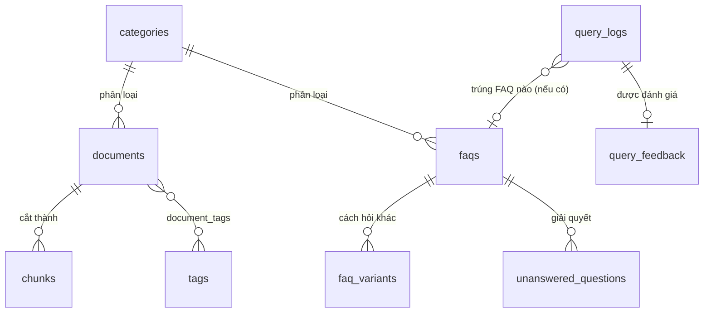

# 03 — Mô hình dữ liệu

> **Đã viết lại theo mô hình không tài khoản** (xem `02-KIEN-TRUC.md`). So với bản gốc: **bỏ** `profiles`, `conversations`, `messages`, `user_api_keys`, `usage_counters`, `audit_logs`, `embedding_queue`, toàn bộ bảng theo dõi quota LLM động (`llm_usage_windows`, `llm_model_state`), và Supabase Storage. **Thêm** `query_logs`, `query_feedback`. RLS đơn giản hoá triệt để vì không còn `auth.uid()`.

Postgres 15 (Supabase) + `pgvector`.

**Thứ tự migration:**

```
0001_extensions.sql        Extension + hàm helper immutable
0002_enums.sql              Kiểu enum
0003_taxonomy.sql           Danh mục, tag
0004_documents.sql          Tài liệu, chunk
0005_faqs.sql                FAQ & biến thể
0006_query_logs.sql         Log câu hỏi, đánh giá
0007_ops.sql                 Câu hỏi chưa trả lời, cache, cấu hình
0008_functions.sql          Hàm tìm kiếm & nghiệp vụ
0009_rls.sql                  Bật RLS + policy
0010_seed.sql                 Dữ liệu khởi tạo
0011_match_faq_source_path.sql   match_faq(): thêm source_path + p_vector_threshold
0012_answer_path_meta_need_key.sql  enum answer_path: thêm 'meta', 'need_key'
0013_log_query_rpc.sql        RPC log_query() — ghi query_logs, trả id
0014_submit_feedback_rpc.sql  RPC submit_feedback() — ghi/ghi đè đánh giá 👍👎
```

> ⚠️ **Mọi thay đổi lược đồ/hàm SQL phải có file ở đây** — không áp thẳng lên DB rồi thôi. Đã xảy ra một lần với `match_faq()` (sửa trên DB mà không có migration), khiến repo dựng ra một DB khác với DB đang chạy; local vẫn chạy tốt nên không ai phát hiện. Xem `AGENTS.md` bất biến #13b.

---

## 0001 — Extension và hàm helper

```sql
create extension if not exists "vector";
create extension if not exists "pg_trgm";
create extension if not exists "unaccent";
create extension if not exists "pgcrypto";

create or replace function public.immutable_unaccent(text)
returns text language sql immutable parallel safe strict
as $$ select public.unaccent('public.unaccent', $1) $$;

create or replace function public.normalize_text(input text)
returns text language sql immutable parallel safe
as $$
  select regexp_replace(
           trim(lower(public.immutable_unaccent(coalesce(input, '')))),
           '\s+', ' ', 'g'
         )
$$;

create or replace function public.touch_updated_at()
returns trigger language plpgsql as $$
begin
  new.updated_at := now();
  return new;
end;
$$;
```

> Y hệt bản gốc — logic chuẩn hoá không phụ thuộc vào việc có tài khoản hay không.

---

## 0002 — Enum

```sql
create type doc_status       as enum ('draft', 'published', 'archived');
create type answer_path      as enum ('faq', 'cache', 'rag', 'refused', 'error');
create type unanswered_state as enum ('pending', 'resolved', 'ignored');
```

> Bỏ `user_role`, `doc_source`, `message_role`, `llm_task` (giờ là type TypeScript, không phải enum DB — xem mục 8), `quota_subject`, `embed_state`.

> **Enum đã được mở rộng ở migration `0012`** thành 7 giá trị: `'faq' | 'cache' | 'rag' | 'refused' | 'error' | 'meta' | 'need_key'`.
> - `'meta'` — câu chỉ là trò chuyện (tầng 0, hoặc tầng 4 khi LLM tự phán đoán `INTENT: chat`). Ghi log là `'meta'` nhưng **gửi `path` rỗng** ra client để giao diện không gắn badge.
> - `'need_key'` — đã hiện lời nhắc nhập key. Không có giá trị này thì không tính được "tỉ lệ bỏ đi khi thấy lời nhắc nhập key".
> - `'cache'` vẫn **không bao giờ xuất hiện** — tầng cache chưa nối vào pipeline (xem 0007).

---

## 0003 — Danh mục và tag

Nguồn sự thật là `data/categories.yaml` trong repo; bảng này là **bản cache** để join nhanh, được `scripts/sync-content.ts` ghi đè mỗi lần chạy.

```sql
create table public.categories (
  id          uuid primary key default gen_random_uuid(),
  slug        text not null unique,          -- khớp tên thư mục trong data/documents/<slug>/
  name        text not null,
  description text,
  icon        text,
  sort_order  int  not null default 0,
  updated_at  timestamptz not null default now()
);

create table public.tags (
  id   uuid primary key default gen_random_uuid(),
  name text not null unique
);

create index tags_name_trgm_idx on public.tags using gin (name gin_trgm_ops);
```

---

## 0004 — Tài liệu và chunk

```sql
create table public.documents (
  id           uuid primary key default gen_random_uuid(),
  source_path  text        not null unique,   -- 'data/documents/lich-hoc/thoi-khoa-bieu-hk1.md'
  title        text        not null,
  content      text        not null,          -- markdown, NGUYÊN VĂN từ file
  summary      text,
  category_id  uuid        references public.categories(id) on delete set null,
  status       doc_status  not null default 'published',
  content_hash text        not null,          -- sha256 nội dung file, để sync bỏ qua file không đổi
  synced_at    timestamptz not null default now(),

  content_tsv  tsvector generated always as (
    to_tsvector('simple',
      public.immutable_unaccent(coalesce(title,'') || ' ' || coalesce(content,''))
    )
  ) stored
);

create index documents_status_idx   on public.documents (status);
create index documents_category_idx on public.documents (category_id);
create index documents_tsv_idx      on public.documents using gin (content_tsv);

create table public.document_tags (
  document_id uuid not null references public.documents(id) on delete cascade,
  tag_id      uuid not null references public.tags(id)      on delete cascade,
  primary key (document_id, tag_id)
);

create table public.chunks (
  id           uuid primary key default gen_random_uuid(),
  document_id  uuid not null references public.documents(id) on delete cascade,
  ordinal      int  not null,
  content      text not null,
  heading_path text,
  token_count  int,
  embedding    vector(768),                   -- NULL nếu embedding lỗi lúc sync — chunk vẫn tìm được qua FTS
  created_at   timestamptz not null default now(),

  content_tsv  tsvector generated always as (
    to_tsvector('simple',
      public.immutable_unaccent(coalesce(heading_path,'') || ' ' || coalesce(content,''))
    )
  ) stored,

  unique (document_id, ordinal)
);

create index chunks_document_idx  on public.chunks (document_id);
create index chunks_tsv_idx       on public.chunks using gin (content_tsv);
create index chunks_embedding_idx on public.chunks using hnsw (embedding vector_cosine_ops)
  with (m = 16, ef_construction = 64);
```

> **Bỏ hoàn toàn:** `document_assets`, `embedding_queue`, `created_by`/`updated_by` (không còn ai đăng nhập để gán), `version` (Git đã giữ lịch sử phiên bản). Thêm `source_path` + `content_hash` để script sync biết file nào đã đổi, file nào bị xoá khỏi repo (→ xoá document tương ứng khỏi DB).

---

## 0005 — FAQ

```sql
create table public.faqs (
  id          uuid primary key default gen_random_uuid(),
  source_path text not null unique,           -- 'data/faqs/deadline-assignment-2.md'
  question    text not null,
  answer      text not null,
  category_id uuid references public.categories(id) on delete set null,
  priority    int  not null default 0,
  is_active   boolean not null default true,
  view_count  int  not null default 0,        -- CHỈ cột này được app cập nhật lúc runtime (tăng dần)
  embedding   vector(768),
  content_hash text not null,
  synced_at   timestamptz not null default now(),

  question_norm text generated always as (public.normalize_text(question)) stored,
  question_tsv  tsvector generated always as (
    to_tsvector('simple', public.immutable_unaccent(coalesce(question,'')))
  ) stored
);

create index faqs_active_idx    on public.faqs (is_active) where is_active;
create index faqs_norm_idx      on public.faqs (question_norm);
create index faqs_tsv_idx       on public.faqs using gin (question_tsv);
create index faqs_trgm_idx      on public.faqs using gin (question_norm gin_trgm_ops);
create index faqs_embedding_idx on public.faqs using hnsw (embedding vector_cosine_ops);

create table public.faq_variants (
  id         uuid primary key default gen_random_uuid(),
  faq_id     uuid not null references public.faqs(id) on delete cascade,
  question   text not null,
  embedding  vector(768),

  question_norm text generated always as (public.normalize_text(question)) stored,
  question_tsv  tsvector generated always as (
    to_tsvector('simple', public.immutable_unaccent(coalesce(question,'')))
  ) stored
);

create index faq_variants_faq_idx       on public.faq_variants (faq_id);
create index faq_variants_norm_idx      on public.faq_variants (question_norm);
create index faq_variants_tsv_idx       on public.faq_variants using gin (question_tsv);
create index faq_variants_trgm_idx      on public.faq_variants using gin (question_norm gin_trgm_ops);
create index faq_variants_embedding_idx on public.faq_variants using hnsw (embedding vector_cosine_ops);
```

> Biến thể giờ soạn trực tiếp trong frontmatter của file `.md` (mảng `variants:`), không có "gợi ý bằng AI qua form admin" nữa — script `sync-content.ts` có thể **in gợi ý ra log build** để bạn tham khảo và tự thêm vào file, nhưng không tự động ghi.

---

## 0006 — Log câu hỏi và đánh giá

Thay cho `conversations`/`messages` (không còn gắn với tài khoản nào). Mỗi lượt hỏi–đáp là **một bản ghi độc lập**, phục vụ thống kê. **Ngữ cảnh nhiều lượt do client tự quản lý** (gửi kèm trong request), server không cần biết "hội thoại" là gì.

> ✅ **Đang dùng thật.** `/api/chat` ghi 1 dòng `query_logs` cho mỗi lượt (kể cả lượt `need_key`) rồi trả `queryLogId` về client trong sự kiện `done`; bấm 👍/👎 ghi vào `query_feedback`.
>
> ⚠️ **Cả 2 bảng đều ghi qua RPC `SECURITY DEFINER`, KHÔNG insert/upsert trực tiếp** — `log_query()` (migration `0013`) và `submit_feedback()` (`0014`). Lý do: hai bảng này cố ý **không có policy SELECT/UPDATE** cho `anon` (cho đọc nghĩa là ai cũng xem được câu hỏi và ghi chú của người khác), nhưng client lại cần lấy `id` vừa tạo (`insert … returning` đòi SELECT) và cần upsert để hỗ trợ "đổi ý" (đòi UPDATE). RPC giải quyết đúng chỗ đó mà không phải nới lỏng RLS. Ai định đổi sang insert trực tiếp sẽ gặp lại lỗi `new row violates row-level security policy`.

```sql
create table public.query_logs (
  id                uuid primary key default gen_random_uuid(),
  question          text not null,
  question_norm     text generated always as (public.normalize_text(question)) stored,
  answer_excerpt    text,                       -- 500 ký tự đầu, đủ để xem nhanh trong thống kê
  path              answer_path not null,
  citations         jsonb not null default '[]'::jsonb,
  faq_id            uuid references public.faqs(id) on delete set null,
  provider          text,                       -- provider CỦA NGƯỜI DÙNG đã dùng, vd 'gemini'
  model             text,
  latency_ms        int,
  client_session_id text,                       -- uuid ngẫu nhiên sinh ở trình duyệt, KHÔNG định danh cá nhân
  created_at        timestamptz not null default now()
);

create index query_logs_created_idx on public.query_logs (created_at desc);
create index query_logs_path_idx    on public.query_logs (path, created_at desc);
create index query_logs_norm_idx    on public.query_logs (question_norm);
```

> `client_session_id` **không phải** định danh người dùng — chỉ là UUID sinh ngẫu nhiên trong `localStorage`, dùng để chống spam đánh giá trùng lặp (mục dưới) và gộp thống kê "bao nhiêu phiên khác nhau đã hỏi", không truy ngược được ra ai.

```sql
create table public.query_feedback (
  id                uuid primary key default gen_random_uuid(),
  query_log_id      uuid not null references public.query_logs(id) on delete cascade,
  rating            smallint not null check (rating in (-1, 1)),
  reason            text check (reason in ('wrong','incomplete','irrelevant','other')),
  note              text,
  client_session_id text,
  created_at        timestamptz not null default now(),
  unique (query_log_id, client_session_id)      -- vẫn chặn spam đánh giá lặp, chỉ khác là theo session ẩn danh
);
```

---

## 0007 — Vận hành

> **Trạng thái sử dụng thật:**
> - `unanswered_questions` — ✅ đang dùng: `pipeline.ts` gọi `record_unanswered()` ở tầng 4 mỗi khi không tìm được gì. Lưu ý cột đếm tên là **`asked_count`** (không phải `hit_count`).
> - `semantic_cache` — 🚧 **chưa triển khai**: bảng có, `src/lib/rag/cache.ts` có sẵn `getSemanticCache()`/`setSemanticCache()`, nhưng **pipeline chưa import/gọi bao giờ**. Nơi duy nhất chạm tới bảng này là `/api/health` (xoá bản ghi hết hạn). Các cấu hình `cache_ttl_days`/`cache_enabled` trong 0010 vì vậy cũng chưa có tác dụng.

```sql
create table public.unanswered_questions (
  id            uuid primary key default gen_random_uuid(),
  question      text not null,
  question_norm text generated always as (public.normalize_text(question)) stored,
  embedding     vector(768),
  asked_count   int  not null default 1,
  last_asked_at timestamptz not null default now(),
  state         unanswered_state not null default 'pending',
  resolved_faq_id uuid references public.faqs(id) on delete set null,
  created_at    timestamptz not null default now()
);

create index unanswered_state_idx     on public.unanswered_questions (state, asked_count desc);
create index unanswered_norm_idx      on public.unanswered_questions (question_norm);
create index unanswered_embedding_idx on public.unanswered_questions using hnsw (embedding vector_cosine_ops);

create table public.semantic_cache (
  id            uuid primary key default gen_random_uuid(),
  question_hash text not null unique,
  question      text not null,
  answer        text not null,
  citations     jsonb not null default '[]'::jsonb,
  hit_count     int  not null default 0,
  created_at    timestamptz not null default now(),
  expires_at    timestamptz not null
);

create index semantic_cache_expires_idx on public.semantic_cache (expires_at);

-- Nguồn sự thật là data/config.yaml; script sync ghi đè bảng này mỗi lần chạy.
-- App đọc bảng này lúc runtime để áp dụng cấu hình MÀ KHÔNG CẦN deploy lại
-- khi bạn chỉ đổi số trong config.yaml rồi push.
create table public.app_settings (
  key         text primary key,
  value       jsonb not null,
  description text,
  updated_at  timestamptz not null default now()
);
```

> **Bỏ** `audit_logs` (Git history thay thế — `git log data/` cho biết ai sửa gì lúc nào, nếu repo có nhiều người thì tên tác giả commit chính là "actor").

---

## 0008 — Hàm tìm kiếm và nghiệp vụ

### Tìm theo vector, full-text, hybrid (RRF), so khớp FAQ

`search_chunks_vector`, `search_chunks_fts`, `search_chunks_hybrid`, `record_unanswered` giữ nguyên bản gốc và **đang được dùng thật** (`search_chunks_hybrid`/`search_chunks_fts` bởi `src/lib/rag/retrieve.ts` ở tầng 3; `record_unanswered` bởi `pipeline.ts` ở tầng 4).

> ⚠️ **`match_faq` đã đổi chữ ký** — đoạn SQL bên dưới là **bản gốc 0008, đã lỗi thời**. Bản đang chạy nằm ở `supabase/migrations/0011_match_faq_source_path.sql`, khác 2 điểm:
> - thêm tham số thứ 4 `p_vector_threshold float default 0.75` (tách khỏi `p_trgm_threshold`, để `matchFaqCandidates()` lấy ứng viên cho bước LLM xác minh ở tầng 2);
> - thêm cột trả về **`source_path text`** — `src/lib/rag/faq-match.ts` cần nó để suy ra slug file `.md` và join lại metadata chỉ có ở local (`is_verified`, `verification_source`, `title`, `media_links`), vì `faq_id` là UUID không join trực tiếp được.
>
> Chữ ký thật:
> ```sql
> match_faq(p_question text, p_embedding vector(768) default null,
>           p_trgm_threshold float default 0.55, p_vector_threshold float default 0.75)
> returns table (faq_id uuid, question text, answer text, match_type text,
>                score float, priority int, source_path text)
> ```

```sql
create or replace function public.search_chunks_vector(
  query_embedding vector(768), match_count int default 20, min_similarity float default 0.0
)
returns table (chunk_id uuid, document_id uuid, content text, heading_path text, document_title text, similarity float)
language sql stable as $$
  select c.id, c.document_id, c.content, c.heading_path, d.title,
         1 - (c.embedding <=> query_embedding) as similarity
    from public.chunks c join public.documents d on d.id = c.document_id
   where d.status = 'published' and c.embedding is not null
     and 1 - (c.embedding <=> query_embedding) >= min_similarity
   order by c.embedding <=> query_embedding
   limit match_count;
$$;

create or replace function public.search_chunks_fts(query_text text, match_count int default 20)
returns table (chunk_id uuid, document_id uuid, content text, heading_path text, document_title text, rank float)
language sql stable as $$
  with q as (select websearch_to_tsquery('simple', public.immutable_unaccent(query_text)) as tsq)
  select c.id, c.document_id, c.content, c.heading_path, d.title,
         ts_rank_cd(c.content_tsv, q.tsq)::float
    from public.chunks c join public.documents d on d.id = c.document_id cross join q
   where d.status = 'published' and c.content_tsv @@ q.tsq
   order by ts_rank_cd(c.content_tsv, q.tsq) desc
   limit match_count;
$$;

create or replace function public.search_chunks_hybrid(
  query_text text, query_embedding vector(768), match_count int default 8, rrf_k int default 60
)
returns table (chunk_id uuid, document_id uuid, content text, heading_path text, document_title text,
               rrf_score float, vector_rank int, fts_rank int)
language sql stable as $$
  with v as (select chunk_id, row_number() over () as rnk from public.search_chunks_vector(query_embedding, 20, 0.0)),
       f as (select chunk_id, row_number() over () as rnk from public.search_chunks_fts(query_text, 20)),
       fused as (
         select coalesce(v.chunk_id, f.chunk_id) as chunk_id,
                coalesce(1.0/(rrf_k+v.rnk),0.0) + coalesce(1.0/(rrf_k+f.rnk),0.0) as score,
                v.rnk::int as v_rank, f.rnk::int as f_rank
           from v full outer join f on v.chunk_id = f.chunk_id
       )
  select c.id, c.document_id, c.content, c.heading_path, d.title, fused.score::float, fused.v_rank, fused.f_rank
    from fused join public.chunks c on c.id = fused.chunk_id
               join public.documents d on d.id = c.document_id
   order by fused.score desc limit match_count;
$$;

create or replace function public.match_faq(
  p_question text, p_embedding vector(768) default null, p_trgm_threshold float default 0.55
)
returns table (faq_id uuid, question text, answer text, match_type text, score float, priority int)
language sql stable as $$
  with norm as (select public.normalize_text(p_question) as q),
  exact as (
    select f.id, f.question, f.answer, 'exact'::text, 1.0::float, f.priority
      from public.faqs f, norm where f.is_active and f.question_norm = norm.q
    union all
    select f.id, f.question, f.answer, 'exact'::text, 1.0::float, f.priority
      from public.faq_variants fv join public.faqs f on f.id = fv.faq_id, norm
     where f.is_active and fv.question_norm = norm.q
  ),
  trigram as (
    select f.id, f.question, f.answer, 'trigram'::text, similarity(f.question_norm, norm.q)::float, f.priority
      from public.faqs f, norm where f.is_active and similarity(f.question_norm, norm.q) >= p_trgm_threshold
    union all
    select f.id, f.question, f.answer, 'trigram'::text, similarity(fv.question_norm, norm.q)::float, f.priority
      from public.faq_variants fv join public.faqs f on f.id = fv.faq_id, norm
     where f.is_active and similarity(fv.question_norm, norm.q) >= p_trgm_threshold
  ),
  vec as (
    select f.id, f.question, f.answer, 'vector'::text, (1-(f.embedding <=> p_embedding))::float, f.priority
      from public.faqs f
     where p_embedding is not null and f.is_active and f.embedding is not null
    union all
    select f.id, f.question, f.answer, 'vector'::text, (1-(fv.embedding <=> p_embedding))::float, f.priority
      from public.faq_variants fv join public.faqs f on f.id = fv.faq_id
     where p_embedding is not null and f.is_active and fv.embedding is not null
  )
  select distinct on (t.id) t.* from
    (select * from exact union all select * from trigram union all select * from vec)
    as t(id, question, answer, match_type, score, priority)
  order by t.id, t.score desc limit 5;
$$;

create or replace function public.record_unanswered(
  p_question text, p_embedding vector(768) default null, p_sim_threshold float default 0.88
)
returns uuid language plpgsql security definer set search_path = public as $$
declare v_id uuid;
begin
  select id into v_id from public.unanswered_questions
   where question_norm = public.normalize_text(p_question) limit 1;

  if v_id is null and p_embedding is not null then
    select id into v_id from public.unanswered_questions
     where embedding is not null and 1 - (embedding <=> p_embedding) >= p_sim_threshold
     order by embedding <=> p_embedding limit 1;
  end if;

  if v_id is not null then
    update public.unanswered_questions set asked_count = asked_count + 1, last_asked_at = now() where id = v_id;
    return v_id;
  end if;

  insert into public.unanswered_questions (question, embedding) values (p_question, p_embedding) returning id into v_id;
  return v_id;
end;
$$;
```

### Tăng `view_count` của FAQ (an toàn, đồng thời)

```sql
create or replace function public.increment_faq_view(p_faq_id uuid)
returns void language sql security definer set search_path = public as $$
  update public.faqs set view_count = view_count + 1 where id = p_faq_id;
$$;
```

> **Bỏ hoàn toàn:** `consume_quota`, `refund_quota`, `reserve_llm_slot`, `cleanup_llm_windows`, `check_variant_limit` (giới hạn 10 biến thể giờ chỉ cần validate ở script sync, không cần trigger DB — không có đường ghi nào khác ngoài sync script), `handle_new_user`, `current_role`, `is_admin`, `is_owner` (không còn khái niệm vai trò).

---

## 0009 — RLS

Đơn giản hoá triệt để: không có `auth.uid()`, không có vai trò. Chỉ hai loại truy cập: **đọc công khai** (role `anon`) và **ghi qua service role** (bỏ qua RLS, dùng bởi `scripts/sync-content.ts` và route handler).

```sql
alter table public.categories           enable row level security;
alter table public.tags                 enable row level security;
alter table public.documents            enable row level security;
alter table public.document_tags        enable row level security;
alter table public.chunks               enable row level security;
alter table public.faqs                 enable row level security;
alter table public.faq_variants         enable row level security;
alter table public.query_logs           enable row level security;
alter table public.query_feedback       enable row level security;
alter table public.unanswered_questions enable row level security;
alter table public.semantic_cache       enable row level security;
alter table public.app_settings         enable row level security;

-- Đọc công khai cho nội dung đã xuất bản
create policy "categories_read" on public.categories for select using (true);
create policy "tags_read"       on public.tags       for select using (true);
create policy "documents_read"  on public.documents  for select using (status = 'published');
create policy "document_tags_read" on public.document_tags for select using (true);
create policy "chunks_read" on public.chunks for select using (
  exists (select 1 from public.documents d where d.id = chunks.document_id and d.status = 'published')
);
create policy "faqs_read"         on public.faqs         for select using (is_active);
create policy "faq_variants_read" on public.faq_variants for select using (true);
create policy "app_settings_read" on public.app_settings for select using (true);

-- App (dùng anon key) được PHÉP GHI vào đúng 4 bảng nhật ký/vận hành — không hơn.
-- Đây là nơi DUY NHẤT cho phép insert từ client role, và chỉ insert, không update/delete.
create policy "query_logs_insert" on public.query_logs for insert with check (true);
create policy "query_feedback_insert" on public.query_feedback for insert with check (true);
create policy "unanswered_upsert" on public.unanswered_questions for all using (true) with check (true);
  -- 'for all' vì record_unanswered() cần update asked_count; chấp nhận vì bảng này không có gì nhạy cảm
create policy "semantic_cache_all" on public.semantic_cache for all using (true) with check (true);
  -- cache cần đọc/ghi/xoá bởi app; không chứa gì hơn nội dung công khai đã có sẵn trong faqs/chunks

-- Ghi documents/chunks/faqs CHỈ qua service role (sync-content.ts) — KHÔNG có policy insert/update/delete
-- nào cho anon trên các bảng này. Service role tự động bỏ qua RLS.
```

> **Bất biến:** không bao giờ thêm policy `insert`/`update`/`delete` cho `anon` trên `documents`, `chunks`, `faqs`, `faq_variants`, `categories`, `tags`. Nếu tương lai cần một endpoint ghi nội dung từ web, đó là lúc phải quay lại cân nhắc auth — không âm thầm nới RLS.

---

## 0010 — Dữ liệu khởi tạo

```sql
insert into public.app_settings (key, value, description) values
  ('faq_trigram_threshold', '0.75'::jsonb,   'Ngưỡng khớp trigram cho FAQ'),
  ('faq_vector_threshold',  '0.90'::jsonb,   'Ngưỡng cosine similarity cho FAQ'),
  ('rag_min_score',         '0.015'::jsonb,  'Điểm RRF tối thiểu để coi là có tài liệu liên quan'),
  ('rag_top_k',             '8'::jsonb,      'Số chunk đưa vào context của LLM'),
  ('rag_candidate_k',       '20'::jsonb,     'Số ứng viên lấy từ mỗi nhánh tìm kiếm'),
  ('chunk_size_tokens',     '800'::jsonb,    'Kích thước chunk mục tiêu'),
  ('chunk_overlap_ratio',   '0.15'::jsonb,   'Tỉ lệ chồng lấn giữa các chunk liền kề'),
  ('cache_ttl_days',        '7'::jsonb,      'Thời gian sống của cache ngữ nghĩa'),
  ('cache_enabled',         'true'::jsonb,   'Bật/tắt cache ngữ nghĩa'),
  ('conversation_context_turns', '6'::jsonb, 'Số lượt hội thoại gần nhất client gửi kèm làm ngữ cảnh'),
  ('refusal_message',
   '"Mình chưa tìm thấy thông tin này trong kho tài liệu của khóa học. Bạn thử diễn đạt lại câu hỏi nhé."'::jsonb,
   'Câu trả lời khi không đủ dữ liệu')
on conflict (key) do nothing;
```

> Đây chỉ là giá trị **khởi tạo lần đầu chạy migration**. Từ lần sync tiếp theo trở đi, `data/config.yaml` là nguồn sự thật — script sync ghi đè các khoá này mỗi lần chạy (xem `06-AI-PIPELINE.md`).

> Không còn `quota_*`, `llm_cooldown_minutes`, `llm_error_threshold`, `llm_max_retries`, `owner_email` — không có quota hệ thống, và router giờ vận hành đơn giản hơn nhiều (xem `06-AI-PIPELINE.md` mục 3 đã viết lại).

---

## Sơ đồ quan hệ



Không còn thực thể nào đại diện cho "người dùng" trong toàn bộ schema — đây là điểm khác biệt cấu trúc rõ nhất so với bản thiết kế gốc.

---

## Ước tính dung lượng

| Bảng | Số bản ghi dự kiến | Tổng |
|---|---|---|
| `chunks` (+ index) | 5.000 | ~40 MB |
| `documents` + `faqs` | 500 + 200 | ~8 MB |
| `query_logs` | 100.000/học kỳ | ~40 MB |
| `unanswered_questions`, `semantic_cache` | vài nghìn | ~5 MB |
| **Tổng** | | **~95 MB** — dư dả hơn nhiều so với thiết kế có tài khoản (không còn `messages`/`llm_call_logs` phình to) |

---

**Tiếp theo:** [`04-API-SPEC.md`](./04-API-SPEC.md) — đặc tả API (đã rút gọn, bỏ toàn bộ endpoint admin).
