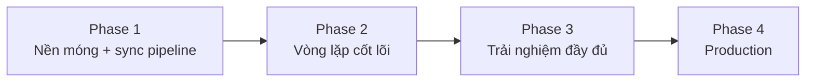

# 08 — Lộ trình thực thi

> **Đã viết lại theo mô hình không tài khoản.** Bỏ toàn bộ phase liên quan auth/admin UI. Thêm phase riêng cho pipeline đồng bộ Git. Tổng thời gian implement **ngắn hơn đáng kể** so với bản gốc — không còn RBAC, không còn ~15 màn hình admin, không còn hệ thống quota động.

Tài liệu này dành cho **agent/lập trình viên thực thi**. Làm tuần tự từ Phase 1.

> ## ✅ Trạng thái: Phase 1–4 đã hoàn thành và đang chạy production
>
> Dự án đã deploy. Các checkbox bên dưới đã được tick theo đúng những gì thật sự tồn tại trong code.
>
> **Còn 8 mục chưa làm (vẫn để `[ ]`), gom thành 3 nhóm:**
>
> | Nhóm | Mục còn treo | Ghi chú |
> |---|---|---|
> | Rate limit theo IP (3.1) | 3 mục Upstash | Chưa có dependency `@upstash/*`; rủi ro tạm chấp nhận vì BYOK — người lạm dụng tiêu quota của chính họ. Xem `02-KIEN-TRUC.md` ADR-15 |
> | Cache ngữ nghĩa (3.4) | 2 mục + 1 DoD | `src/lib/rag/cache.ts` đã viết nhưng **pipeline chưa gọi** → `path='cache'` không bao giờ xảy ra |
> | Đánh giá 👍/👎 (3.3) | `<FeedbackButtons>` | Component đã viết nhưng **chưa render ở đâu**, và phụ thuộc `query_logs` vốn chưa được ghi. Xem `03-DATA-MODEL.md` mục 0006 |
>
> Mục "Validate key bằng cách gửi thử một câu hỏi ngắn" (3.1) cũng chưa làm — trang Cài đặt hiện lưu key thẳng, trạng thái lỗi chỉ lộ ra sau lần hỏi đầu tiên.
>
> **Việc đã làm nhưng roadmap gốc không hề có:** tầng đối thoại (`converse.ts`), tầng RAG tổng quát nối vào pipeline, streaming từng đoạn, `npm run audit` làm cổng chặn FAQ trùng lặp, mở rộng từ 4 lên 7 provider.

---

## Tổng quan 4 phase

| Phase | Mục tiêu | Kết quả bàn giao |
|---|---|---|
| 1 | Nền móng + pipeline nội dung | Project chạy được, DB có schema, `scripts/sync-content.ts` nạp được nội dung mẫu qua GitHub Action |
| 2 | Vòng lặp cốt lõi | Hỏi FAQ (không cần key) và hỏi RAG (có key) đều trả lời được, có trích dẫn |
| 3 | Trải nghiệm đầy đủ | Trang Cài đặt, lịch sử trình duyệt, đánh giá, cache, OCR cục bộ |
| 4 | Sẵn sàng production | Đánh giá chất lượng, bảo mật, deploy |

---

## Phase 1 — Nền móng + pipeline nội dung

### 1.1 Khởi tạo project
- [x] `npx create-next-app@latest` — TypeScript, Tailwind, App Router
- [x] Bật `strict: true`, `noUncheckedIndexedAccess`
- [x] `npx shadcn@latest init` + component ở `07-UI-UX.md` mục 8
- [x] Cài: `@supabase/supabase-js` `zod` `react-hook-form` `@hookform/resolvers` `react-markdown` `remark-gfm` `rehype-sanitize` `date-fns` `next-themes` `lucide-react` `tsx` (chạy script TS)
- [x] `.env.example` theo `02-KIEN-TRUC.md` mục 4 — **không có** `OWNER_EMAIL`, `ENCRYPTION_KEY`
- [x] `lib/env.ts` validate biến môi trường
- [x] Cấu trúc thư mục theo `02-KIEN-TRUC.md` mục 3, gồm cả `data/` và `scripts/`
- [x] Script `"verify": "npm run lint && npm run typecheck && npm run test && npm run audit && npm run build"` trong `package.json` — lệnh duy nhất cần nhớ để tự kiểm tra trước khi push. Bước `audit` (`scripts/audit-faqs.ts`) là **cổng chặn thật**: phát hiện FAQ trùng nội dung hoặc trùng dữ kiện tham chiếu (SĐT/email lặp ở ≥2 file) thì `exit 1`. Husky `pre-push` chạy `verify` nên FAQ trùng lặp bị chặn ngay ở cửa push
- [x] Cài `husky` + hook `pre-push` chạy `npm run verify`, chặn push nếu fail:
  ```bash
  npx husky init
  echo "npm run verify" > .husky/pre-push
  ```
- [x] Test thử: cố tình để lỗi lint, chạy `git push` → xác nhận bị chặn thật (không phải chỉ có hook tồn tại mà không hoạt động)

### 1.2 Database
- [x] Tạo project Supabase (region Singapore), bật `vector`, `pg_trgm`, `unaccent`
- [x] Migration `0001`→`0010` theo `03-DATA-MODEL.md` — **không tạo** bảng liên quan auth/quota/audit
- [x] `npx supabase gen types typescript` → `src/types/database.ts`
- [x] **Kiểm chứng RLS:** anon key `select` được `documents` (`published`), **không** `insert` được vào bảng đó

### 1.3 Nội dung mẫu và pipeline đồng bộ — **hạng mục quan trọng nhất phase này**
- [x] Soạn `data/categories.yaml` với 5–7 danh mục
- [x] Soạn 2–3 file mẫu trong `data/documents/` (có frontmatter đúng chuẩn)
- [x] Soạn 2–3 file mẫu trong `data/faqs/`
- [x] Soạn `data/config.yaml`
- [x] `lib/rag/normalize.ts` + unit test đối chiếu với `normalize_text()` SQL
- [x] `lib/rag/chunk.ts` — cắt theo heading, không cắt đôi bảng markdown
- [x] `lib/rag/embed.ts` — nhận `apiKey` làm tham số bắt buộc (không có key mặc định)
- [x] `scripts/sync-content.ts`:
  - Đọc toàn bộ `data/documents/**/*.md` và `data/faqs/**/*.md`
  - Parse frontmatter (dùng `gray-matter` hoặc tương đương)
  - So `content_hash`, bỏ qua file không đổi
  - Cắt chunk, tạo embedding (dùng `GEMINI_API_KEY` từ biến môi trường cục bộ/GitHub Secret)
  - Upsert vào Supabase qua service role key
  - Xoá document/faq có `source_path` không còn tồn tại trong `data/`
  - Đọc `data/config.yaml`, validate, ghi vào `app_settings`
  - Xoá `semantic_cache`
  - Log rõ ràng: file nào xử lý, file nào lỗi
- [x] `.github/workflows/sync-content.yml` — trigger khi push vào `data/**`, chạy `npx tsx scripts/sync-content.ts`
- [x] Chạy tay `npm run sync` cục bộ trước, xác nhận nội dung mẫu vào đúng database
- [x] Push thử lên GitHub, xác nhận Action tự chạy và thành công

### DoD Phase 1
- [x] `npm run build` không lỗi
- [x] `npm run verify` chạy sạch, và git hook `pre-push` **thực sự chặn được** push khi cố tình để lỗi (đã test giả lập)
- [x] `npx tsx scripts/sync-content.ts` chạy thành công cục bộ, nội dung mẫu xuất hiện trong Supabase
- [x] Push vào `data/**` → GitHub Action tự chạy, xanh trên tab Actions
- [x] Sửa một file, push lại → chỉ file đó được xử lý (kiểm tra qua log Action), file khác bị bỏ qua nhờ `content_hash`
- [x] Xoá một file, push → document tương ứng biến mất khỏi DB

---

## Phase 2 — Vòng lặp cốt lõi

### 2.1 Đường FAQ (không cần key) *(F02)*
- [x] `lib/rag/faq-match.ts` — RPC `match_faq`, xử lý đúng: tầng 1/2 chạy dù không có embedding, tầng 3 bỏ qua nếu `query_embedding = null`
- [x] `increment_faq_view()` gọi đúng lúc trúng

### 2.2 Đường RAG (cần key) *(F03)*
- [x] `lib/rag/retrieve.ts` — RPC `search_chunks_hybrid`
- [x] Xử lý `query_embedding = null` → chỉ chạy `search_chunks_fts`
- [x] `lib/prompts/*` — chép nguyên văn từ `06-AI-PIPELINE.md` mục 6
- [x] `lib/rag/pipeline.ts` — điều phối theo sơ đồ mục 1, **trả `need_key` đúng lúc** thay vì cố chạy tiếp mà không có key
- [x] `lib/llm/router.ts` — theo pseudo-code `06-AI-PIPELINE.md` mục 3 (đã đơn giản hoá, không có bảng quota)
- [x] Adapter provider: `gemini.ts` `groq.ts` `cerebras.ts` `openrouter.ts` — mỗi hàm nhận `apiKey` làm tham số
- [x] `POST /api/chat` — đọc header `X-LLM-Provider`/`X-LLM-Key`, trả SSE đúng định dạng `04-API-SPEC.md`
- [x] **Xác nhận key không rò rỉ:** không gán vào biến module-level, không log, không đưa vào `query_logs`
- [x] Luồng từ chối + `record_unanswered()`

### 2.3 Giao diện chat tối thiểu *(F01)*
- [x] `<ChatContainer>` đọc SSE bằng `fetch` + `getReader()`
- [x] `<MessageBubble>` + `<MarkdownRenderer>` (bắt buộc `rehype-sanitize`)
- [x] `<CitationChip>` + `<CitationPanel>`
- [x] `<Composer>`
- [x] `<NeedKeyPrompt>` — hiện khi nhận sự kiện `need_key`
- [x] Design token theo `07-UI-UX.md` mục 2 (tông navy/cyan). `app-header.tsx` hiện tên app bằng `--font-display` (Exo 2, **tạm thời**) — **TODO chưa chốt:** thay bằng ảnh/SVG logo thật khi ban tổ chức cấp file, xem cảnh báo trong `07-UI-UX.md` mục 2

### DoD Phase 2
- [x] Hỏi câu trùng FAQ (không gửi header key) → trả lời đúng, < 500ms
- [x] Hỏi câu cần RAG mà không gửi key → nhận `need_key`, giao diện hiện lời mời rõ ràng, **không phải trang lỗi**
- [x] Gửi key Gemini hợp lệ, hỏi câu cần RAG → trả lời có trích dẫn
- [x] Tắt key Gemini, gửi key Groq thay thế → vẫn trả lời được (RAG dùng Groq cho sinh câu trả lời; nếu Groq không hỗ trợ embedding thì FTS đảm nhiệm phần truy xuất)
- [x] Hỏi câu ngoài phạm vi → từ chối rõ ràng, không bịa

---

## Phase 3 — Trải nghiệm đầy đủ

### 3.1 Cài đặt và BYOK *(F12)*
- [x] Trang `/settings` với `<ApiKeyManager>`
- [x] Lưu/đọc/xoá key ở `localStorage` — **không có API endpoint nào lưu key phía server**
- [ ] Validate key bằng cách gửi thử một câu hỏi ngắn qua `/api/chat`
- [x] Nội dung hướng dẫn lấy key theo `07-UI-UX.md` mục 4
- [ ] Tạo tài khoản Upstash (free tier, không cần thẻ) tại upstash.com, tạo 1 Redis database, lấy `UPSTASH_REDIS_REST_URL` + `UPSTASH_REDIS_REST_TOKEN`
- [ ] Cài `@upstash/ratelimit` + `@upstash/redis`, viết `lib/rate-limit.ts` áp cho `/api/chat` (FR-53) — **không dùng `Map`/biến toàn cục**, xem lý do ở `02-KIEN-TRUC.md` ADR-15
- [ ] Test: gửi > 20 request/phút cùng IP → nhận `429 RATE_LIMITED` thật (không chỉ đọc code thấy có vẻ đúng)

### 3.2 Lịch sử hội thoại *(F05)*
- [x] `lib/client-storage.ts` — wrapper quanh `localStorage`, xử lý lỗi khi đầy/bị chặn
- [x] Sidebar hội thoại đọc từ `localStorage`
- [x] Ngữ cảnh: client tự cắt 6 lượt gần nhất, gửi trong `history`
- [x] Tiêu đề tự sinh bằng cắt chuỗi (không gọi LLM)

### 3.3 Đánh giá *(F06)*
- [x] `clientSessionId` sinh một lần bằng `crypto.randomUUID()`, lưu `localStorage`
- [ ] `<FeedbackButtons>` + `POST /api/chat/feedback`

### 3.4 Cache ngữ nghĩa *(F04)*
- [ ] `lib/rag/cache.ts` — tra theo hash, **không cần key để đọc**
- [ ] Xác nhận `scripts/sync-content.ts` xoá cache đúng ở bước cuối

### 3.5 OCR cục bộ *(F08)*
- [x] `scripts/ocr-image.ts` — nhận đường dẫn ảnh, gọi model vision bằng key cục bộ, in markdown ra stdout
- [x] Prompt theo `06-AI-PIPELINE.md` mục 6.3
- [x] `npm run ocr -- path/to/image.png [--hint "..."]`
- [x] **Xác nhận script không tự ghi vào `data/`** — chỉ in ra, người dùng tự copy-paste

### DoD Phase 3
- [x] Nhập key ở `/settings` → dùng được RAG ngay, không cần tải lại trang
- [x] Xoá key → quay về chỉ dùng được FAQ
- [x] Đóng mở lại trình duyệt (không xoá cache) → lịch sử hội thoại còn nguyên
- [ ] Hỏi lại đúng câu vừa hỏi → `path='cache'`, không cần key
- [x] Chạy `npm run ocr` với ảnh mẫu → ra markdown hợp lý
- [x] Grep toàn bộ codebase + log: không có chỗ nào ghi giá trị API key của người dùng

---

## Phase 4 — Sẵn sàng production

### 4.1 Đánh giá chất lượng
- [x] `tests/eval/retrieval.json` ≥ 30 cặp câu hỏi/tài liệu
- [x] `tests/eval/injection.json` theo `06-AI-PIPELINE.md` mục 8.2
- [x] Script chạy đánh giá, in Recall@8, MRR, độ chính xác từ chối, tỉ lệ từ chối sai
- [x] Hiệu chỉnh `rag_min_score` bằng ≥ 50 câu hỏi thật (sửa trong `data/config.yaml`, push)
- [x] Toàn bộ test injection pass

### 4.2 Bảo mật
- [x] `get_advisors` của Supabase, sửa cảnh báo RLS
- [x] Xác nhận `SUPABASE_SERVICE_ROLE_KEY` không lọt vào bundle client
- [x] CSP header, `X-Frame-Options: DENY`
- [x] **Rà toàn bộ đường xử lý request:** xác nhận `X-LLM-Key` không bao giờ được gán vào biến sống ngoài phạm vi request, không log, không đưa vào response
- [x] Kiểm thử: gọi `/api/chat` không có key, có key sai, có key đúng — đúng hành vi ở cả ba trường hợp

### 4.3 Hiệu năng
- [x] Đo P95 độ trễ đường FAQ và RAG
- [x] Lighthouse: LCP ≤ 2,5s, CLS ≤ 0,1
- [x] `explain analyze` cho các hàm tìm kiếm

### 4.4 Nội dung và deploy
- [x] Nạp nội dung thật của khóa học vào `data/`
- [x] Soạn ≥ 20 FAQ, mỗi cái có ≥ 3 biến thể
- [x] Import repo vào Vercel, khai báo biến môi trường app (mục 4 của `02-KIEN-TRUC.md`)
- [x] Khai báo GitHub Secrets cho sync pipeline
- [x] Deploy, khói test toàn bộ luồng chính
- [x] Bật `.github/workflows/keepalive.yml`

### DoD Phase 4 — Checklist trước khi chia sẻ cho học viên
- [x] Toàn bộ test đánh giá đạt ngưỡng
- [x] Toàn bộ test injection pass
- [x] Không tìm thấy API key nào bị log ở bất kỳ đâu (grep toàn bộ log + source)
- [x] Đã có ≥ 20 FAQ và nội dung khóa học đầy đủ
- [x] Cron keep-alive đã chạy thành công ít nhất một lần
- [x] GitHub Action `sync-content` đã chạy thành công với nội dung thật
- [x] Đã thử nghiệm với ≥ 5 người dùng thật (kể cả người chưa từng lấy API key bao giờ — kiểm tra xem hướng dẫn có đủ rõ không)

---

## Thứ tự phụ thuộc



**Không được đảo thứ tự:**
- Pipeline đồng bộ (`scripts/sync-content.ts`) phải xong **trước** vì không có nó thì không có dữ liệu gì để test đường FAQ/RAG.
- `lib/rag/chunk.ts` và `lib/rag/embed.ts` viết một lần, dùng chung cho cả app và script — không viết hai bản.
- Chuẩn hoá text (`normalize.ts` ↔ `normalize_text()` SQL) phải khớp tuyệt đối, làm ngay Phase 1.

---

## Những chỗ dễ sai nhất

| Vấn đề | Hậu quả | Cách phòng |
|---|---|---|
| `unaccent()` không IMMUTABLE | Migration fail | Dùng hàm bọc `immutable_unaccent()` |
| Quên xử lý chữ `đ` khi bỏ dấu | Khớp chuỗi FAQ trượt | Test theo bảng ở `06-AI-PIPELINE.md` mục 2 |
| Dùng `EventSource` cho `/api/chat` | Không gửi được body (chỉ hỗ trợ GET) | `fetch` + `getReader()` |
| **Gán `X-LLM-Key` vào biến sống ngoài phạm vi request** | Rò rỉ key của người này sang request của người khác | Đọc header, dùng ngay trong hàm xử lý request đó, không cache/lưu ở đâu |
| **Log request/response chứa key** | Lộ key trong log Vercel | Không log toàn bộ header; nếu log lỗi thì lọc bỏ `X-LLM-Key` trước khi ghi |
| Quên `rehype-sanitize` | XSS qua nội dung LLM sinh ra | Bắt buộc trong `<MarkdownRenderer>` |
| Cache cả câu hỏi có ngữ cảnh trước đó | Trả lời sai ngữ cảnh | Chỉ cache câu đầu tiên (`history` rỗng) |
| Cho LLM viết lại câu trả lời FAQ | Bịa đặt xen vào chỗ đáng lẽ chính xác nhất | Trả nguyên văn từ file `.md` |
| `scripts/ocr-image.ts` tự ghi vào `data/` | Mất bước duyệt, sai sót vào thẳng KB | Script chỉ in ra, không bao giờ ghi file |
| Cắt đôi bảng markdown khi chunk | Chunk mất header bảng | Không cắt bảng, dù vượt kích thước |
| Quên `taskType` khi gọi Gemini embedding | Chất lượng truy xuất giảm | `RETRIEVAL_DOCUMENT` / `RETRIEVAL_QUERY` |
| Thêm policy RLS `insert`/`update` cho `anon` trên `documents`/`faqs` "cho tiện" | Mở lại đúng lỗ hổng đã cố tình đóng khi bỏ admin UI | Chỉ service role (sync script) được ghi nội dung — không nới RLS |

---

## Sau khi ra mắt

| Tần suất | Việc |
|---|---|
| Hàng tuần | `select question, asked_count from unanswered_questions where state='pending' order by asked_count desc` — soạn FAQ mới nếu cần |
| Hàng tuần | Xem đánh giá 👎 qua SQL, tìm nguyên nhân |
| Hàng tháng | Kiểm tra dung lượng database |
| Hàng tháng | Đối chiếu lại free tier các nhà cung cấp LLM có đổi gì không (ảnh hưởng `MODEL_CATALOG` trong code) |
| Mỗi học kỳ | Rà soát toàn bộ `data/`, cập nhật nội dung |

### Ý tưởng cho phiên bản sau (không thuộc phạm vi v1)
- Rerank bằng LLM
- Dashboard nhẹ thay cho truy vấn SQL tay
- Nếu nhu cầu tài khoản thật sự xuất hiện (ví dụ lưu tiến độ học tập cá nhân), quay lại thiết kế Supabase Auth + RLS theo `auth.uid()` — bản thiết kế gốc vẫn còn trong lịch sử Git của tài liệu này để tham khảo
- Diff thông minh trong sync script thay vì full resync, nếu `data/` phình lên hàng nghìn file

---

**Tiếp theo:** [`09-QUY-TRINH-PHOI-HOP.md`](./09-QUY-TRINH-PHOI-HOP.md) — quy trình bàn giao và review giữa Claude Code và Antigravity khi thực thi roadmap này.

**Quay lại:** [`README.md`](../README.md) · [`00-TONG-QUAN.md`](./00-TONG-QUAN.md)
