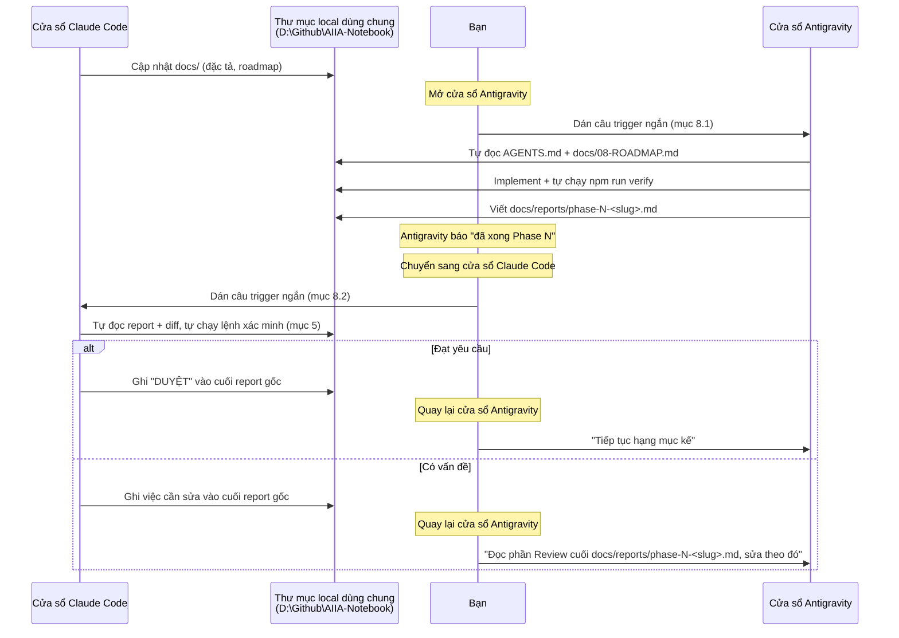

# 09 — Quy trình phối hợp Claude ↔ Antigravity

> Tài liệu này áp dụng cho **cả hai bên**: Claude Code (lên kế hoạch, viết đặc tả, review) và Antigravity (đọc đặc tả, viết code, báo cáo lại). Nếu bạn là AI agent đang đọc file này để bắt đầu công việc, đọc hết trước khi làm bất cứ điều gì.

---

## 1. Vai trò và ràng buộc thực tế

| | Claude Code | Antigravity |
|---|---|---|
| Việc chính | Viết/sửa tài liệu `docs/`, review code Antigravity đã viết | Đọc `docs/` + `AGENTS.md`, viết code, chạy test |
| Không làm | Không tự viết code ứng dụng | Không tự đổi kiến trúc/phạm vi đã chốt trong `docs/` |
| Xem được code chưa? | Chỉ khi được yêu cầu review, đọc trực tiếp từ repo | Luôn — đang làm việc trong repo |

**Ràng buộc quan trọng nhất chi phối toàn bộ tài liệu này:** cả hai đều là **ứng dụng dạng cửa sổ (GUI/IDE agent), không phải CLI tự động hoá được**. Không có API hay kênh nào để chúng gọi lẫn nhau. Bạn (người dùng) ngồi giữa hai cửa sổ, **tự tay chuyển đổi và dán** mỗi khi cần chuyển việc từ bên này sang bên kia. Hệ quả:

- **Kênh chia sẻ dữ liệu thật sự là thư mục local dùng chung** (`D:\Github\AIIA-Notebook`), không phải lời bạn kể lại. Cả Claude Code và Antigravity đều đọc/ghi trực tiếp vào cùng một bộ file trên đĩa — đây là nơi thông tin thực sự "truyền" giữa hai bên, không phải qua trí nhớ của bạn.
- **Việc bạn phải làm ở mỗi lượt chỉ là:** mở đúng cửa sổ, dán **đúng một câu lệnh ngắn kích hoạt** (mẫu ở mục 8) — **không cần copy nội dung file nào cả**, vì bên nhận tự đọc file trong thư mục dùng chung.
- Mọi thứ hai bên cần biết về nhau phải nằm **trong file, trong repo** — không giả định "bên kia nhớ được" điều gì từ một cuộc hội thoại trước, vì mỗi cửa sổ mới là một phiên hoàn toàn không có trí nhớ về phiên trước.

> ✅ **Đã xác nhận (04/08/2026):** Antigravity tự chạy được terminal trong đúng thư mục dự án (`npm run verify`, `git push`...) — giống cách Claude Code đang làm ở đây. Toàn bộ mục 4 và 8 dưới đây dựa trên giả định này: Antigravity tự thực thi và tự dán output thật vào report, không cần bạn chạy tay thay.

---

## 2. Vòng lặp bàn giao



**Điểm mấu chốt:** bạn không cần đọc hay hiểu nội dung kỹ thuật để chuyển tiếp — chỉ cần đúng 2 câu trigger ngắn ở mục 8. Mọi nội dung thật (đặc tả, code, report, review) nằm trong file, hai agent tự đọc lấy.

**Nguyên tắc:** một hạng mục trong `docs/08-ROADMAP.md` = một vòng lặp bàn giao. Không gộp nhiều hạng mục lớn vào một lần bàn giao — report càng nhỏ, càng dễ kiểm chứng thật, càng khó lọt hallucination.

---

## 3. Nguyên tắc nền: "Không tin — chỉ xác minh"

Áp dụng cho **cả hai bên**, không ngoại lệ:

1. **Không khẳng định điều gì về code mà chưa tự đọc.** "Hàm này chắc đã tồn tại" không được chấp nhận — phải `grep`/`Read` ra thật.
2. **Không khẳng định test đã chạy mà chưa thực sự chạy lệnh đó trong phiên này.** Không suy luận "chắc sẽ pass" từ việc đọc code.
3. **Mọi con số/API/hành vi thư viện không chắc chắn phải gắn nhãn cảnh báo**, không trình bày như sự thật đã kiểm chứng. Xem mục 6.1.
4. **Trích dẫn `file:line` cho mọi khẳng định về code hiện có** — trong report, trong review, trong tài liệu.
5. **Im lặng đoán bừa khi gặp mơ hồ là vi phạm.** Cách xử lý đúng ở mục 7.

---

## 4. Định dạng báo cáo hoàn thành (Antigravity viết)

Sau khi làm xong **một hạng mục** trong roadmap, tạo file `docs/reports/phase-N-<slug-hạng-mục>.md` theo đúng khung này — không tự do định dạng:

```markdown
# Báo cáo: Phase N — <tên hạng mục>

## 1. Đối chiếu checklist
Copy nguyên văn các dòng checklist liên quan từ 08-ROADMAP.md, đánh dấu:
- [x] Đã làm — <mô tả 1 dòng CỤ THỂ, không phải "đã xong">
- [ ] Chưa làm — <lý do>
- [~] Làm một phần — <phần nào chưa, tại sao>

## 2. File đã tạo/sửa
| File | Loại thay đổi | Tóm tắt |
|---|---|---|
| src/lib/rag/chunk.ts | Mới | Cắt chunk theo heading, xem hàm `chunkMarkdown()` dòng 12 |

## 3. Lệnh đã chạy để xác minh — DÁN OUTPUT THẬT, không diễn giải
\`\`\`
$ npm run verify
<paste NGUYÊN VĂN TOÀN BỘ output — gồm cả 5 bước lint / typecheck / test / audit / build,
 kể cả các warning. KHÔNG được cắt bớt bước nào.>
\`\`\`
\`\`\`
$ git push origin main
<paste nguyên văn output, gồm cả dòng hash "abc1234..def5678  main -> main">
\`\`\`

## 4. Đối chiếu acceptance criteria
Với MỖI AC trong 05-FEATURES.md liên quan tới hạng mục này:
- AC "Không bao giờ cắt một bảng markdown làm đôi" → Đã test bằng case nào, kết quả gì (file:line của test)

## 5. Sai lệch so với đặc tả (deviation log)
Nếu có chỗ nào implement khác với docs/ (kể cả nhỏ):
- Đặc tả nói gì (trích dẫn file:line trong docs/)
- Đã làm gì thay vào đó, tại sao
- Đã chọn phương án AN TOÀN HƠN theo AGENTS.md mục "Khi gặp việc chưa rõ" chưa?

## 6. Câu hỏi mở — CẦN TRẢ LỜI TRƯỚC KHI DUYỆT
Liệt kê mọi điểm mơ hồ/mâu thuẫn trong spec mà bạn TỰ QUYẾT tạm thời, xin xác nhận lại.
Nếu không có mục nào, ghi rõ "Không có câu hỏi mở" — không được bỏ trống mục này.

## 7. Chưa làm / chưa test — không được giấu
Liệt kê rõ những gì NẰM TRONG PHẠM VI hạng mục này nhưng chưa hoàn thành hoặc chưa verify được.
```

**Quy tắc bắt buộc:** mục 3 (output lệnh) và mục 6/7 (câu hỏi mở, phần chưa làm) là **bắt buộc phải có nội dung hoặc ghi rõ "không có"**. Report thiếu các mục này bị coi là không hợp lệ, Claude Code từ chối review.

---

## 5. Checklist review (Claude Code làm)

**Không được duyệt chỉ vì report nói "đã xong".** Trước khi duyệt, tự làm — bằng tool thật, không suy luận từ report:

1. `git diff` hoặc đọc trực tiếp các file trong bảng mục 2 của report — xác nhận thay đổi khớp mô tả.
2. Với **ít nhất 1–2 khẳng định** trong report (chọn ngẫu nhiên, ưu tiên chỗ quan trọng/rủi ro cao), tự chạy lại lệnh xác minh tương ứng — không tin nguyên văn output đã dán.
3. Đối chiếu mục 4 (AC) của report với `docs/01-SRS.md`/`05-FEATURES.md` — AC nào report tuyên bố đạt mà không có bằng chứng cụ thể (test file, lệnh chạy) thì coi là **chưa đạt**.
4. Grep các bất biến trong `AGENTS.md` mục "Bất biến" — đặc biệt: không có `X-LLM-Key`/API key nào bị log hoặc gán ra biến ngoài phạm vi request, không có policy RLS mới cho `insert`/`update` trên bảng nội dung, không có `lib/supabase/admin.ts` bị import vào Client Component.
5. Đọc mục 5 (deviation log) và mục 6 (câu hỏi mở) — trả lời rõ ràng từng câu, không bỏ sót.
6. Ghi kết quả review **ngay vào cuối file report gốc** (không tạo file review riêng):

```markdown
## Review (Claude Code — <ngày>)
Kết luận: DUYỆT / CẦN SỬA

Đã tự kiểm chứng:
- <lệnh/tool đã tự chạy để xác minh, không phải chỉ đọc report>

Phản hồi cho câu hỏi mở:
- <câu hỏi> → <quyết định>

Việc cần sửa (nếu CẦN SỬA):
- <file:line cụ thể, mô tả cụ thể — không viết chung chung "cải thiện thêm">
```

---

## 6. Chống hallucination theo từng bên

### 6.1 Với Claude Code (khi viết/sửa đặc tả)

- Con số/hạn mức/API bên thứ ba (rate limit provider, phiên bản thư viện, hành vi API chưa tự gọi thử) → gắn `⚠️ CẦN XÁC MINH KHI TRIỂN KHAI`, không viết như sự thật cố định. Đã áp dụng ở `02-KIEN-TRUC.md` mục 5 (hạn mức Gemini) — dùng làm mẫu.
- **Chỉ yêu cầu hoặc thực hiện `npm run sync` / deploy khi người dùng yêu cầu trực tiếp.** Nếu người dùng chưa yêu cầu, chỉ hướng dẫn/review công việc ở môi trường local để người dùng tự kiểm tra chức năng.
- Không tự bịa tên hàm/API của thư viện (Supabase, Next.js, provider LLM) nếu không chắc — nếu cần dẫn API cụ thể mà không chắc chắn, ghi rõ "kiểm tra lại tài liệu chính thức của X trước khi dùng" thay vì đưa một chữ ký hàm có thể sai.
- Khi review code Antigravity viết: **không được duyệt dựa trên việc đọc report thấy hợp lý** — phải tự mở file, tự chạy lệnh (mục 5).
- Không tự ý đổi phạm vi/kiến trúc đã chốt (ví dụ: không tự thêm lại hệ thống tài khoản) khi chỉ đang làm nhiệm vụ review một hạng mục nhỏ.

### 6.2 Với Antigravity (khi code)

- **Không claim "đã test"/"hoạt động đúng"** nếu chưa thực sự chạy lệnh trong phiên làm việc đó. Copy nguyên văn output vào report (mục 4).
- **Không tự bịa file/hàm/bảng đã tồn tại** — trước khi sửa một file, phải đọc nó trước. Trước khi gọi một hàm SQL, phải xác nhận nó có trong `03-DATA-MODEL.md` hoặc migration đã chạy.
- **Không âm thầm nới lỏng bất biến trong `AGENTS.md`** để "cho dễ code" (ví dụ: tạm log API key để debug rồi quên xoá — đây là lỗi nghiêm trọng, không phải tiểu tiết).
- **Không tự quyết định thay đổi kiến trúc/phạm vi.** Gặp spec không khả thi hoặc mâu thuẫn với chính nó → xử lý theo mục 7, không tự "sửa cho hợp lý" rồi không báo.
- Khi báo cáo file đã sửa, **trích dẫn đúng đường dẫn và số dòng thật** — không tóm tắt kiểu "đã cập nhật logic router" mà không chỉ ra chỗ nào.
- **Mọi thay đổi lược đồ/hàm SQL phải kèm file trong `supabase/migrations/`.** Áp thẳng lên DB (Studio/MCP/psql) rồi coi là xong là lỗi nghiêm trọng: repo sẽ dựng ra một DB khác với DB đang chạy, local vẫn chạy tốt nên không ai phát hiện cho tới khi deploy mới hỏng. Xem `AGENTS.md` bất biến #13b.

#### ⚠️ Lỗi đã xảy ra thật — bịa output lệnh

Trong quá trình review đã bắt được **2 báo cáo có phần "Output thật" không phải copy từ terminal**:

1. Một báo cáo ghi hash `git push` là `f9d0c64` — hash này **không tồn tại** ở bất kỳ đâu trong `git log`/`git reflog`.
2. Một báo cáo khác ghi `0bb260e..1a65dc8  main -> main`, nhưng parent thật của `1a65dc8` là `f134c76` → dòng đó không thể là output thật của lần push đó.

Cả 2 báo cáo còn có chung một dấu hiệu: khối output `npm run verify` **nhảy thẳng từ dòng lệnh sang phần typecheck**, thiếu hẳn phần lint (mà lint thì luôn in ra 6 warning `` cố định).

**Cách người review kiểm tra** (nên làm mọi lần): đối chiếu hash trong report với `git log --format="%H %P"`, và kiểm tra output `verify` có đủ cả 5 bước không. Report thiếu/sai ở mục 3 bị coi là **không hợp lệ**, phải làm lại — kể cả khi code bên dưới đúng.

---

## 7. Xử lý khi gặp mơ hồ hoặc mâu thuẫn

Áp dụng khi Antigravity thấy đặc tả không rõ, hoặc hai phần tài liệu mâu thuẫn nhau:

1. **Không tự bịa cách hiểu rồi lặng lẽ code theo đó.**
2. Chọn phương án **an toàn/bảo thủ hơn** theo đúng tinh thần `AGENTS.md` mục "Khi gặp việc chưa rõ" (ví dụ: không lưu key thay vì lưu "tạm thời để test", không nới RLS thay vì nới cho tiện).
3. Ghi rõ vào mục 6 (Câu hỏi mở) của report: đã hiểu spec thế nào, đã chọn phương án nào, vì sao.
4. **Tiếp tục làm phần còn lại không phụ thuộc câu hỏi đó** — không dừng toàn bộ hạng mục chỉ vì một điểm mơ hồ nhỏ.
5. Claude Code trả lời dứt khoát ở bước review (mục 5) — nếu câu trả lời làm đổi hướng phần đã code, ghi rõ cần sửa lại chỗ nào.

---

## 8. Việc bạn cần làm — chỉ 2 câu trigger, không phải soạn prompt mỗi lần

Cả hai agent đều trỏ vào **cùng thư mục** `D:\Github\AIIA-Notebook` trên máy bạn. Bạn không cần copy nội dung file nào, không cần tóm tắt hay diễn giải lại — chỉ cần mở đúng cửa sổ và dán đúng câu dưới đây. Agent tự đọc phần còn lại từ đĩa.

### 8.1 Mở cửa sổ Antigravity — giao việc mới hoặc tiếp tục

Điền `<Phase N.X>` bằng đúng mục trong `docs/08-ROADMAP.md` (ví dụ "Phase 1 mục 1.1–1.3"), rồi dán:

```
Đọc AGENTS.md và docs/08-ROADMAP.md mục <Phase N.X> trong thư mục dự án này.
Làm đúng phạm vi đó, không làm trước phần Phase sau.
Trước khi git push: tự chạy npm run verify, xác nhận PASS cả 5 bước
(lint / typecheck / test / audit / build). Riêng bước audit chặn FAQ
trùng lặp — nếu báo LỖI NẶNG thì phải sửa, không được bỏ qua.
Sau khi xong, viết báo cáo tại docs/reports/phase-N-<slug>.md
theo đúng khung ở docs/09-QUY-TRINH-PHOI-HOP.md mục 4 — không bỏ trống
mục "câu hỏi mở" và "chưa làm/chưa test".
```

### 8.2 Mở cửa sổ Claude Code — nhờ review

Sau khi Antigravity báo đã xong và đã tạo file report, chuyển sang cửa sổ Claude Code, dán:

```
Antigravity đã báo xong <Phase N.X>. Review docs/reports/phase-N-<slug>.md
theo đúng quy trình ở docs/09-QUY-TRINH-PHOI-HOP.md mục 5 — tự đọc diff và
tự chạy lại ít nhất một lệnh xác minh, đừng chỉ tin nội dung report.
Ghi kết quả review vào cuối chính file report đó.
```

### 8.3 Sau khi có kết quả review

- **DUYỆT** → quay lại cửa sổ Antigravity, dán: `"Đã duyệt Phase N.X, tiếp tục làm <Phase N.Y kế tiếp>."`
- **CẦN SỬA** → quay lại cửa sổ Antigravity, dán: `"Đọc phần Review ở cuối docs/reports/phase-N-<slug>.md, sửa đúng những gì ghi trong đó."`

### Quy tắc chung
- **Không tự diễn giải/tóm tắt nội dung kỹ thuật giữa hai bên** — chỉ trỏ tới file, để agent tự đọc. Diễn giải qua lời bạn kể là nguồn hallucination phổ biến nhất trong mô hình này.
- Nếu một agent hỏi lại bạn điều gì đó **kỹ thuật** (ví dụ "chunk size nên để bao nhiêu?") mà câu trả lời đã có sẵn trong `docs/`, chỉ cần trỏ nó tới đúng file/mục — đừng tự trả lời thay tài liệu.

---

## 9. Checklist trước khi coi một hạng mục thực sự xong

- [ ] Report tồn tại ở `docs/reports/`, đủ 7 mục theo khung ở mục 4
- [ ] Mục 3 (output lệnh) có nội dung thật, không phải mô tả suông
- [ ] Mục 6 (câu hỏi mở) đã được Claude Code trả lời dứt khoát trong phần Review
- [ ] Claude Code đã tự chạy ít nhất một bước xác minh độc lập (không chỉ đọc report)
- [ ] Không bất biến nào trong `AGENTS.md` bị vi phạm — đã grep kiểm tra
- [ ] Checkbox tương ứng trong `docs/08-ROADMAP.md` đã tick

---

**Xem thêm:** [`AGENTS.md`](../AGENTS.md) — quy ước code Antigravity phải tuân thủ khi thực thi. [`08-ROADMAP.md`](./08-ROADMAP.md) — nguồn của mọi hạng mục công việc.
