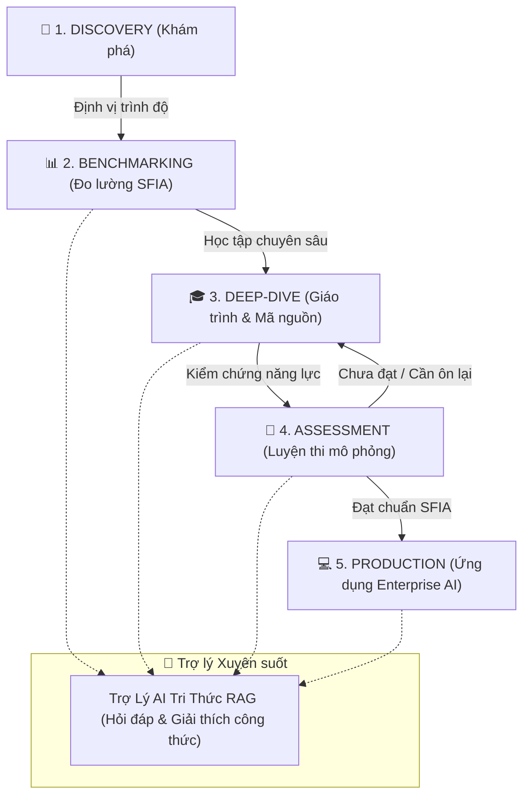

# KIẾN TRÚC LUỒNG TRẢI NGHIỆM NGƯỜI DÙNG (UX JOURNEY & FLOW ARCHITECTURE)

> **Tài liệu Đặc tả Kiến trúc Trải nghiệm Người dùng & Luồng Tương tác Toàn diện**  
> Dự án: **AI SFIA Community Hub**  
> Tiêu chuẩn: **SFIA 8 & Bloom's Taxonomy**  
> Đối tượng: **Cộng đồng Kỹ sư AI, Lập trình viên & Người học**

---

## 🧭 1. TỔNG QUAN HÀNH TRÌNH NGƯỜI DÙNG (USER JOURNEY MAP)

Hệ thống được thiết kế theo phễu trải nghiệm 4 giai đoạn khép kín:

---

## 🚀 2. CHI TIẾT 4 PHÂN TẦNG TRẢI NGHIỆM (4-TIER UX EXPERIENCE)

### 🌟 Giai đoạn 1: Khám Phá & Định Vị (Discovery & Home Experience)
1. **Entry Point**: Người dùng truy cập trang chủ (`/`).
2. **Hero Section**:
   - Tiếp nhận thông điệp chuẩn hóa quốc tế: **SFIA 8** & **Bloom's Taxonomy**.
   - Thống kê 4 con số trực quan: 7 Level SFIA, 7 Chuyên đề lý thuyết, 100% Mock tests học thuật, Kiến trúc Enterprise.
3. **CTA Direct Paths**:
   - Lựa chọn 1 trong 3 hành động chính: *"Khám phá Ma trận SFIA"*, *"Xem Giáo trình"* hoặc *"Làm bài Thi thử"*.

---

### 📊 Giai đoạn 2: Đo Lường & So Sánh (SFIA Matrix Explorer)
1. **Filter & Search**:
   - Chọn nhanh cấp độ từ `L1` (Follow) đến `L7` (Set Strategy).
   - Tìm kiếm từ khóa kỹ thuật: `Attention`, `Qdrant`, `LoRA`, `Agent`, `vLLM`.
2. **Level Profile Card**:
   - Đọc mức độ tự chủ (**Autonomy**).
   - Thang đo nhận thức (**Bloom's Taxonomy**).
   - Dự án thực hành bàn giao tương ứng (**Deliverables**).

---

### 🎓 Giai đoạn 3: Học Tập & Tiếp Thu Tri Thức (Curriculum & Syllabi Deep-Dive)
1. **Duyệt 7 Chuyên đề kỹ thuật**:
   - Đọc lý thuyết chuyên sâu (Đại số ma trận, Cosine, Scaled Dot-Product, Asyncio, HNSW, ReAct, LoRA, PagedAttention).
2. **Mã nguồn thực chiến (Interactive Code Block)**:
   - Đọc code mẫu chuẩn Python/TypeScript.
   - Nút **Copy 1-click** (kèm phản hồi visual toast *"Đã chép!"*).
3. **Hỗ trợ giải đáp AI tức thì**:
   - Bấm sang tab **Trợ Lý AI** để được giải thích từng dòng công thức hoặc tùy biến code.

---

### 📝 Giai đoạn 4: Đánh Giá Năng Lực (Mock Assessments Engine)
1. **Khóa An Toàn Pháp Lý (Legal Safeguard Checkpoint)**:
   - Trước khi bắt đầu, người dùng đọc thông báo cam kết: *"Đây là đề thi mô phỏng học thuật độc lập 100%, không phải đề thi thật"*.
   - Bấm *"Tôi Đồng Ý & Bắt Đầu"* để kích hoạt phòng thi.
2. **Phòng Thi Tương Tác (Live Exam Runner)**:
   - Đồng hồ đếm ngược (Live Countdown Timer).
   - Thanh tiến độ câu hỏi (Visual Progress Bar).
   - Lựa chọn đáp án $A, B, C, D$ phản hồi xúc giác mượt mà.
3. **Bảng Điểm & Phân Tích Lỗi Sai (Root-Cause Explanations)**:
   - Điểm số phần trăm (%) và xếp loại Đạt chuẩn SFIA (VD: *Đạt chuẩn SFIA Level 3 $\to$ Level 4*).
   - Đọc giải thích chi tiết cho từng câu sai để bù đắp lỗ hổng kiến thức ngay lập tức.

---

## 🔍 3. TỐI ƯU HÓA CÔNG CỤ TÌM KIẾM (SEO & DISCOVERABILITY ARCHITECTURE)

| Thành phần kỹ thuật | Chi tiết triển khai | Mục đích SEO |
|---|---|---|
| **Dynamic Sitemap (`/sitemap.xml`)** | Sinh tự động qua Next.js `src/app/sitemap.ts` với đầy đủ ưu tiên (`priority 1.0` cho trang chủ, `0.9` cho Ma trận/Giáo trình). | Giúp GoogleBot lập chỉ mục toàn bộ nội dung nhanh chóng. |
| **Robots Rules (`/robots.txt`)** | Sinh tự động qua `src/app/robots.ts`, cho phép toàn bộ crawler tiếp cận nội dung học thuật mở. | Khai báo sitemap chính thức cho các search engine. |
| **OpenGraph & Twitter Cards** | Cấu hình trong `src/app/layout.tsx` với preview card độ phân giải 1200x630. | Tối ưu hóa chia sẻ link trên Facebook, Zalo, LinkedIn, X/Twitter. |
| **Schema.org Structured Data** | JSON-LD `@graph` tích hợp `WebSite`, `Course`, `EducationalOccupationalCredential`, `SoftwareApplication`. | Kích hoạt Rich Snippets trên kết quả tìm kiếm của Google (Star ratings, Course syllabus). |
| **PWA Manifest (`/manifest.json`)** | Web App Manifest đầy đủ icons 192x192, 512x512, theme color `#080d1a`. | Hỗ trợ cài đặt trực tiếp lên màn hình Home Screen của điện thoại và Desktop. |
