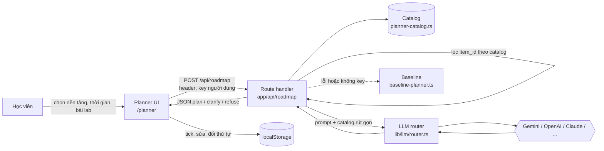

# 02 — Kiến trúc

## 1. Tổng quan

Prototype là một ứng dụng **Next.js 15 (App Router)** trong `codebase/`. Lát cắt dự thi Planner chạy trong app này, không phụ thuộc backend .NET.



## 2. Tech stack

| Lớp | Công nghệ | Dùng cho |
|---|---|---|
| Framework | Next.js 15 App Router, React 19 | UI + route handler |
| Ngôn ngữ | TypeScript `strict`, `noUncheckedIndexedAccess` | Toàn bộ app |
| Giao diện | Tailwind CSS 3, lucide-react, GSAP | Wizard, checklist |
| Validate | zod, react-hook-form | Đầu vào/đầu ra API |
| AI | `lib/llm/router.ts` — 7 provider, BYOK, thử provider kế tiếp khi lỗi trước token đầu tiên (trừ key sai) | Planner và Chat K.AI |
| Dữ liệu | Supabase Postgres + pgvector, RLS | Chat K.AI (không bắt buộc cho Planner) |
| Kiểm thử | Vitest | Unit test + eval |
| CI | Husky pre-push (`npm run verify`) | Chặn push khi lỗi |

## 3. Cấu trúc `codebase/`

```
codebase/
├── src/
│   ├── app/                  ← trang + route handler (api/chat, api/roadmap)
│   ├── app/planner/          ← trang Planner (không cần đăng nhập)
│   ├── components/planner/   ← study-planner.tsx (UI 4 bước + checklist)
│   ├── components/learning/  ← AI Mentor 4 sprint (quy tắc chạy trên FE)
│   ├── components/chat/      ← Chat K.AI gọi API và widget Helpdesk mô phỏng
│   ├── lib/
│   │   ├── llm/              ← router + adapter từng provider
│   │   ├── rag/              ← pipeline Chat K.AI
│   │   ├── planner/          ← baseline-planner.ts (luật tĩnh, baseline + fallback)
│   │   └── api/              ← client gọi backend .NET (có fallback)
│   ├── data/                 ← planner-catalog.ts (catalog Planner) + dữ liệu SFIA của dự án nền
│   └── types/
├── data/
│   ├── faqs/, documents/     ← kho tri thức cho Chat K.AI
├── supabase/migrations/      ← schema Postgres
├── tests/                    ← unit + eval của Chat
├── scripts/                  ← sync nội dung, audit FAQ, OCR
├── backend-core/, database/  ← .NET — auth và ghi danh tích hợp một phần (docs/06-backend-dotnet.md)
└── backend-services/         ← script sinh nội dung của dự án nền, không chạy trong app
```
## 4. Ranh giới thật / mock

| Thành phần | Trạng thái |
|---|---|
| `/api/roadmap` + Planner FE | Đã nối; có key hợp lệ thì gọi LLM qua router, không có key/lỗi thì dùng baseline |
| Catalog | Thật, nhóm tự soạn, chỉ chứa link công khai |
| Checklist trên trình duyệt | Thật |
| Chat K.AI | FE gọi `/api/chat` thật; FAQ/RAG/LLM phụ thuộc key và dịch vụ liên quan |
| AI Mentor 4 sprint | Quy tắc chạy tại FE; chưa có API/LLM cho wizard, PDF/DOC mới lấy tên file |
| Widget AI Helpdesk nổi | Trả lời mẫu theo từ khoá sau `setTimeout`; bộ chọn model chưa tác động đến router |
| Đăng nhập .NET | FE gọi register/login thật khi backend chạy; OAuth cần cấu hình provider |
| Ghi danh khoá học .NET | Ghi `localStorage` và gọi đồng bộ nền khi có user ID; màn học chưa đọc module/progress từ .NET |
| Gói Pro, thanh toán, chứng chỉ trên FE | Chưa phải luồng tích hợp đầy đủ |

## 5. Quy tắc phân lớp

```
Planner UI → app/api/roadmap → lib/llm/router → provider
Chat K.AI → app/api/chat → lib/rag → lib/llm/router / Supabase
```
- Component không gọi thẳng provider LLM hay database.
- Mọi lời gọi LLM đi qua `lib/llm/router.ts`.
- Link hiển thị cho người dùng chỉ lấy từ catalog.

## 6. Lưu ý kỹ thuật đã biết

| Vấn đề | Ảnh hưởng | Xử lý |
|---|---|---|
| FE cho nhập FPT key nhưng router chưa đăng ký FPT adapter | Chỉ có FPT key thì Planner dùng baseline, Chat có thể yêu cầu key | Đăng ký adapter và bổ sung vào thứ tự ưu tiên trước khi giới thiệu là đã hỗ trợ |
| Tên model cố định trong adapter; widget Helpdesk có bộ chọn model mô phỏng | Người dùng chưa thực sự chọn được model | Nối widget với `/api/chat` nếu đưa vào phạm vi sản phẩm |
| `codebase/.github/workflows/` không chạy | GitHub chỉ chạy workflow ở `.github/` gốc repo | Không cần cho hackathon; chuyển ra gốc nếu muốn bật CI |
| `backend-core/appsettings.json` có JWT secret và mật khẩu Postgres dev ghi cứng | Chỉ dùng cho local, nhưng repo công khai | Đổi sang biến môi trường nếu tích hợp .NET |
| `backend-services/`, `scripts/curriculum/` trỏ tới giáo trình đã chuyển sang `docs/legacy/curriculum/` | Script sinh giáo trình không chạy được | Không dùng trong lát cắt |
