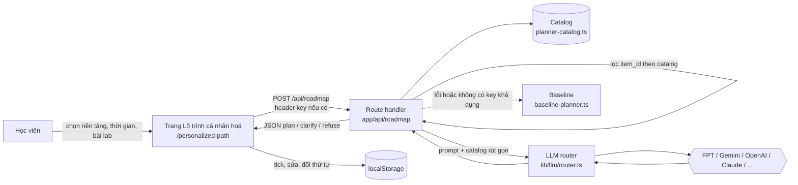

# 02 — Kiến trúc

## 1. Tổng quan

Prototype là một ứng dụng **Next.js 15 (App Router)** trong `codebase/`. Tính năng được chấm (Lộ trình cá nhân hoá, do AI Mentor thực hiện) chạy trong app này, không phụ thuộc backend .NET.



## 2. Tech stack

| Lớp | Công nghệ | Dùng cho |
|---|---|---|
| Framework | Next.js 15 App Router, React 19 | UI + route handler |
| Ngôn ngữ | TypeScript `strict`, `noUncheckedIndexedAccess` | Toàn bộ app |
| Giao diện | Tailwind CSS 3, lucide-react, GSAP | Wizard, checklist |
| Validate | zod | Đầu vào API và đầu ra LLM của AI Mentor (tính năng Lộ trình cá nhân hoá) |
| AI | `lib/llm/router.ts` — router chung hỗ trợ 7 provider; AI Helpdesk hiện chỉ truyền Gemini key để kết quả nhất quán | AI Mentor và AI Helpdesk |
| Dữ liệu | Supabase Postgres + pgvector, RLS | AI Helpdesk (không bắt buộc cho AI Mentor) |
| Kiểm thử | Vitest | Unit test + eval |
| Kiểm tra tự động | GitHub Actions tại `.github/workflows/verify.yml`; Husky pre-push chạy `npm run verify` | Kiểm tra PR và trước khi push |

## 3. Cấu trúc `codebase/`

```
codebase/
├── src/
│   ├── app/                  ← trang + route handler (api/chat, api/roadmap)
│   ├── app/personalized-path/ ← trang Lộ trình cá nhân hoá (không cần đăng nhập)
│   ├── components/planner/   ← study-planner.tsx (UI 4 bước + checklist)
│   ├── components/learning/  ← wizard lộ trình 4 sprint (quy tắc chạy trên FE, không gọi AI)
│   ├── components/chat/      ← widget AI Helpdesk thật, gọi /api/chat
│   ├── lib/
│   │   ├── llm/              ← router + adapter từng provider
│   │   ├── rag/              ← pipeline AI Helpdesk
│   │   ├── planner/          ← baseline-planner.ts (luật tĩnh, baseline + fallback)
│   │   └── api/              ← client gọi backend .NET (có fallback)
│   ├── data/                 ← planner-catalog.ts (thư viện tài liệu mà AI Mentor chọn) + dữ liệu SFIA của dự án nền
│   └── types/
├── data/
│   ├── faqs/                 ← FAQ công khai cho AI Helpdesk
│   ├── Vlearn_data/          ← Markdown gốc Day 1–15, local-only và git-ignore
│   └── private-documents/    ← 34 Markdown chuẩn hóa, audience learning, local-only
├── supabase/migrations/      ← schema Postgres
├── tests/                    ← unit + eval của Chat
├── scripts/                  ← sync nội dung, audit FAQ, OCR
├── backend-core/, database/  ← .NET — auth và ghi danh tích hợp một phần (docs/06-backend-dotnet.md)
└── backend-services/         ← script sinh nội dung của dự án nền, không chạy trong app
```
## 4. Ranh giới thật / mock

| Thành phần | Trạng thái |
|---|---|
| `/api/roadmap` + trang Lộ trình cá nhân hoá | Đã nối; có key hợp lệ từ header hoặc biến môi trường thì gọi LLM qua router, không có key/lỗi thì dùng baseline |
| Catalog | Thật, nhóm tự soạn, chỉ chứa link công khai |
| Checklist trên trình duyệt | Thật |
| AI Helpdesk | FE gọi `/api/chat` thật; FAQ/RAG/LLM phụ thuộc key và dịch vụ liên quan |
| Wizard lộ trình 4 sprint (`/learning`) | Quy tắc chạy tại FE; chưa có API/LLM cho wizard, PDF/DOC mới lấy tên file |
| Widget AI Helpdesk nổi | Gắn `ChatBox` vào layout toàn app; gọi `/api/chat`, stream SSE, hiển thị citations và feedback |
| Đăng nhập .NET | FE gọi register/login thật khi backend chạy; OAuth cần cấu hình provider |
| Ghi danh khoá học .NET | Ghi `localStorage` và gọi đồng bộ nền khi có user ID; màn học chưa đọc module/progress từ .NET |
| Gói Pro, thanh toán, chứng chỉ trên FE | Chưa phải luồng tích hợp đầy đủ |

## 5. Quy tắc phân lớp

```
Trang Lộ trình cá nhân hoá → app/api/roadmap → lib/llm/router → provider
AI Helpdesk → app/api/chat → backend auth (`/api/v1/auth/me`) → Supabase session memory + role gate + roadmap context → lib/rag → lib/llm/router / Supabase
```
- Component không gọi thẳng provider LLM hay database.
- Mọi lời gọi LLM đi qua `lib/llm/router.ts`.
- Link hiển thị cho người dùng chỉ lấy từ catalog.

## 6. Lưu ý kỹ thuật đã biết

| Vấn đề | Ảnh hưởng | Xử lý |
|---|---|---|
| Helpdesk tạm khóa Gemini 3.5 Flash-Lite | Người dùng chưa chọn model trong widget | Giữ một model để kết quả nhất quán; chỉ mở chọn model khi có yêu cầu sản phẩm |
| `backend-core/appsettings.json` có JWT secret và mật khẩu Postgres dev ghi cứng | Chỉ dùng cho local, nhưng repo công khai | Đổi sang biến môi trường nếu tích hợp .NET |
| `backend-services/`, `scripts/curriculum/` trỏ tới giáo trình đã chuyển sang `docs/legacy/curriculum/` | Script sinh giáo trình không chạy được | Không dùng trong lát cắt |
