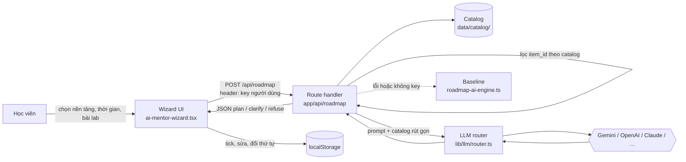

# 02 — Kiến trúc

## 1. Tổng quan

Prototype là một ứng dụng **Next.js 15 (App Router)** trong `codebase/`. Toàn bộ lát cắt dự thi chạy trong app này; không cần backend .NET, không cần deploy.



## 2. Tech stack

| Lớp | Công nghệ | Dùng cho |
|---|---|---|
| Framework | Next.js 15 App Router, React 19 | UI + route handler |
| Ngôn ngữ | TypeScript `strict`, `noUncheckedIndexedAccess` | Toàn bộ app |
| Giao diện | Tailwind CSS 3, lucide-react, GSAP | Wizard, checklist |
| Validate | zod, react-hook-form | Đầu vào/đầu ra API |
| AI | `lib/llm/router.ts` — 7 provider, BYOK, tự chuyển provider khi lỗi | Lời gọi LLM thật |
| Dữ liệu | Supabase Postgres + pgvector, RLS | Chat K.AI (không bắt buộc cho Planner) |
| Kiểm thử | Vitest | Unit test + eval |
| CI | Husky pre-push (`npm run verify`) | Chặn push khi lỗi |

## 3. Cấu trúc `codebase/`

```
codebase/
├── src/
│   ├── app/                  ← trang + route handler (api/chat, api/roadmap*)
│   ├── components/learning/  ← ai-mentor-wizard.tsx (UI Planner)
│   ├── lib/
│   │   ├── llm/              ← router + adapter từng provider
│   │   ├── rag/              ← pipeline Chat K.AI
│   │   ├── roadmap-ai-engine.ts  ← baseline luật tĩnh
│   │   └── api/              ← client gọi backend .NET (có fallback)
│   ├── data/                 ← dữ liệu tĩnh SFIA/giáo trình của dự án nền
│   └── types/
├── data/
│   ├── faqs/, documents/     ← kho tri thức cho Chat K.AI
│   └── catalog/*             ← catalog tài liệu lab cho Planner
├── supabase/migrations/      ← schema Postgres
├── tests/                    ← unit + eval của Chat
├── scripts/                  ← sync nội dung, audit FAQ, OCR
├── backend-core/, database/  ← .NET — chưa tích hợp (docs/06-backend-dotnet.md)
└── backend-services/         ← script sinh nội dung của dự án nền, không chạy trong app
```
`*` = chưa có, sẽ tạo khi build lát cắt.

## 4. Ranh giới thật / mock

| Thành phần | Trạng thái |
|---|---|
| `/api/roadmap` + LLM | Thật (đang build) |
| Catalog | Thật, nhóm tự soạn, chỉ chứa link công khai |
| Checklist trên trình duyệt | Thật |
| Đăng nhập, gói Pro, thanh toán, chứng chỉ | Mock |
| Gọi backend .NET | Tự fallback về `localStorage` khi .NET không chạy |

## 5. Quy tắc phân lớp

```
components → app/api/* → lib/llm, lib/rag → lib/supabase → Postgres
```
- Component không gọi thẳng provider LLM hay database.
- Mọi lời gọi LLM đi qua `lib/llm/router.ts`.
- Link hiển thị cho người dùng chỉ lấy từ catalog.

## 6. Lưu ý kỹ thuật đã biết

| Vấn đề | Ảnh hưởng | Xử lý |
|---|---|---|
| Router gắn tên model cũ (`claude-3-5-sonnet`, `gpt-4o-mini`) | Có thể lỗi với provider đã ngừng model | Cập nhật khi build `/api/roadmap` |
| `codebase/.github/workflows/` không chạy | GitHub chỉ chạy workflow ở `.github/` gốc repo | Không cần cho hackathon; chuyển ra gốc nếu muốn bật CI |
| `backend-core/appsettings.json` có JWT secret và mật khẩu Postgres dev ghi cứng | Chỉ dùng cho local, nhưng repo công khai | Đổi sang biến môi trường nếu tích hợp .NET |
| `backend-services/`, `scripts/curriculum/` trỏ tới giáo trình đã chuyển sang `docs/legacy/curriculum/` | Script sinh giáo trình không chạy được | Không dùng trong lát cắt |
