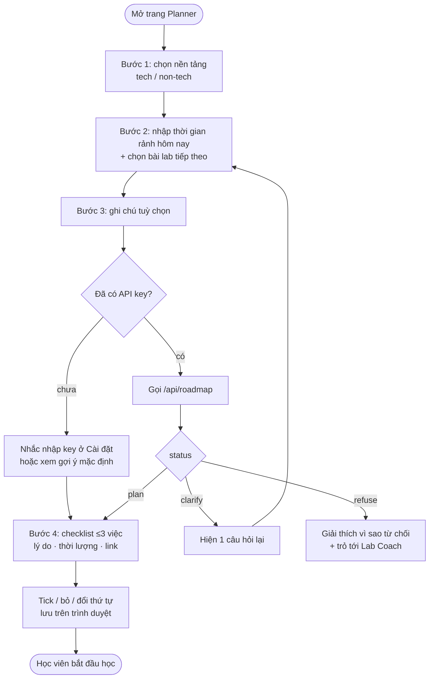

# 05 — Luồng người dùng · Planner

> Dùng cho **CP2** (hạn 21:00 · 16/9). Người phụ trách: Thành.

## 1. Luồng chính

## 2. Màn hình

| Bước | Hiển thị | Hành động |
|---|---|---|
| 1 · Nền tảng | 2 thẻ lựa chọn có mô tả ngắn | Chọn 1 |
| 2 · Thời gian & bài lab | Ô số phút, danh sách bài lab từ catalog | Nhập, chọn |
| 3 · Ghi chú | Ô text ≤500 ký tự, gợi ý "Bạn đang vướng gì?" | Tuỳ chọn |
| 4 · Kết quả | Dòng chẩn đoán + checklist; nhãn "AI" hoặc "Gợi ý mặc định" | Tick, bỏ, kéo thả, mở link |
| Hỏi lại | Một câu hỏi + nút quay lại bước 2 | Trả lời |
| Từ chối | Lý do + kênh hỗ trợ chính thức | Quay lại |

## 3. Hiện thực (CP2 · 16/9)

Trang riêng **`/planner`** — không cần đăng nhập, không cần gói Pro. Không sửa wizard cũ (`ai-mentor-wizard.tsx`) vì gắn chặt với luồng tài khoản.

| File | Vai trò |
|---|---|
| `codebase/src/app/planner/page.tsx` | Route |
| `codebase/src/components/planner/study-planner.tsx` | UI 4 bước + checklist (tick, bỏ, đổi thứ tự, khôi phục), lưu `localStorage` |
| `codebase/src/lib/planner/baseline-planner.ts` | Luật tĩnh: clarify (<30 phút, lab lạ), refuse (làm hộ, đáp án, gia hạn, điểm, ghi đè chỉ dẫn), chọn ≤3 việc theo nền tảng + ghi chú |
| `codebase/src/data/planner-catalog.ts` | Catalog mẫu 2 bài lab, chỉ link công khai |
| `codebase/tests/unit/baseline-planner.test.ts` | 9 test cho luật trên |

**Trạng thái:** CP3 đã nối `/api/roadmap` gọi LLM thật. Luật tĩnh vẫn được giữ làm baseline và fallback có nhãn rõ ràng (SRS FR-P09).

## 4. Nộp CP2

Chọn một: bản mock bấm được · sơ đồ luồng ở mục 1 · video quay màn hình đi hết một lượt. CP2 chưa yêu cầu AI chạy thật.
