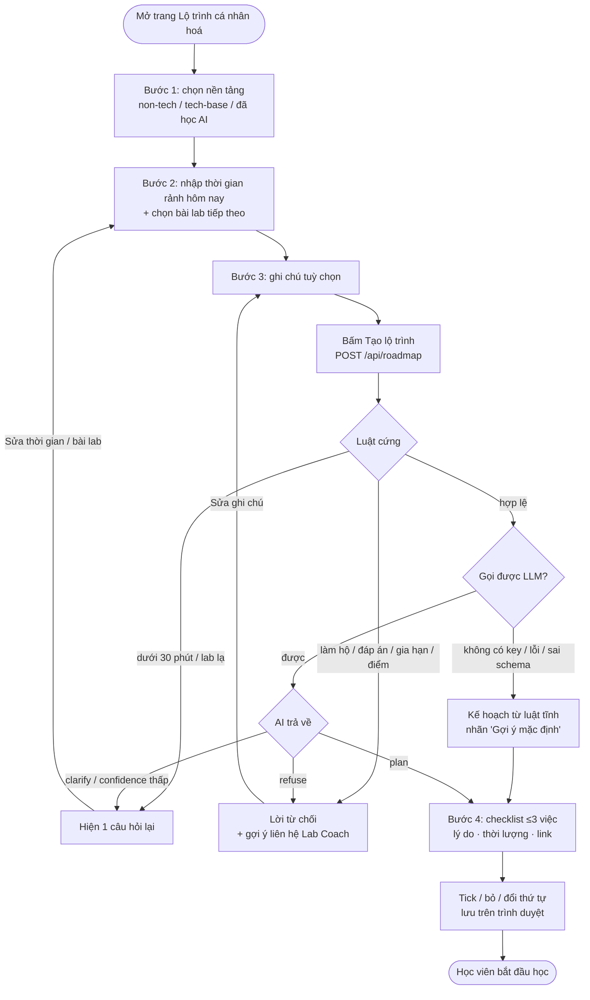
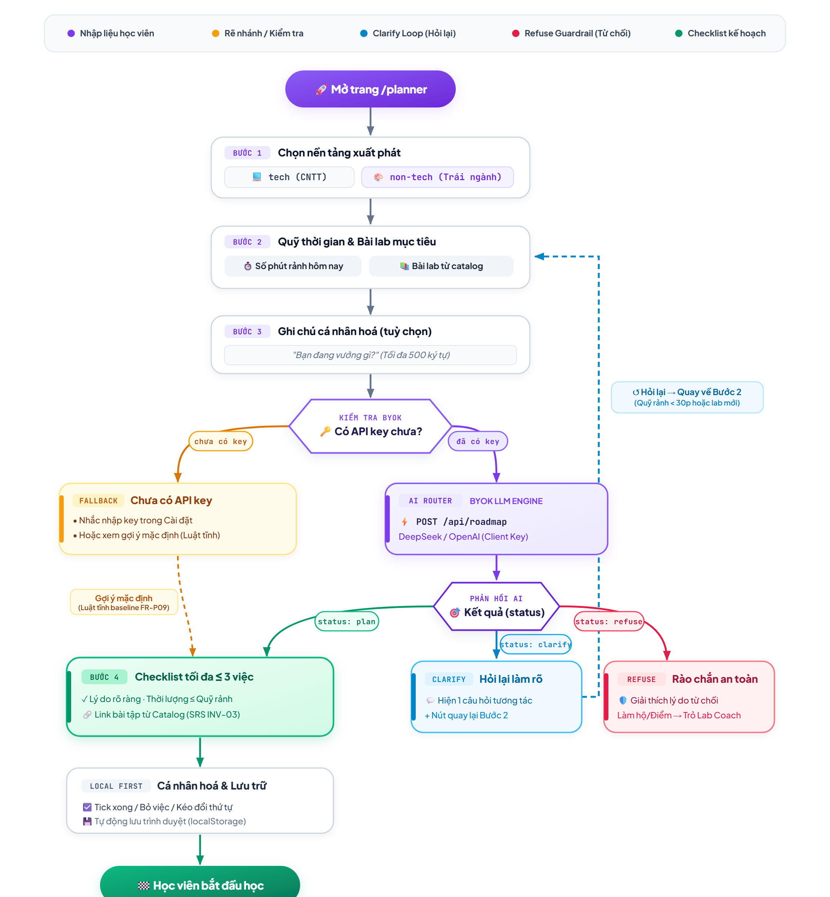

# 05 — Luồng người dùng · Lộ trình cá nhân hoá

> Dùng cho **CP2** (hạn 21:00 · 16/9). Người phụ trách: Thành.

## 1. Luồng chính

Trang không kiểm tra key trước khi gọi API: key (nếu có) được gửi kèm header, server tự dùng luật tĩnh khi không gọi được LLM.

Ảnh sơ đồ xuất ở CP2 (vẽ theo bản nháp cũ: 2 mức nền tảng, có bước kiểm tra key). Sơ đồ mermaid phía trên là bản khớp code hiện tại; ảnh sẽ được xuất lại sau.

## 2. Màn hình

| Bước | Hiển thị | Hành động |
|---|---|---|
| 1 · Nền tảng | 3 thẻ lựa chọn có mô tả ngắn: Non-tech, Tech-base, Đã học AI | Chọn 1 |
| 2 · Thời gian & bài lab | Nút chọn nhanh 30/45/60/90/120 phút, ô số phút (0–600), danh sách bài lab từ catalog | Nhập, chọn |
| 3 · Ghi chú | Ô text ≤500 ký tự, gợi ý "Bạn đang vướng gì?" | Tuỳ chọn |
| 4 · Kết quả | Dòng chẩn đoán + checklist; nhãn "AI" hoặc "Gợi ý mặc định · chưa cá nhân hoá bằng AI" | Tick, bỏ, đổi thứ tự bằng nút lên/xuống, khôi phục đề xuất, mở link |
| Hỏi lại | Một câu hỏi + nút "Sửa thời gian / bài lab" (về bước 2) | Sửa rồi tạo lại |
| Từ chối | Lời từ chối, gợi ý liên hệ Lab Coach + nút "Sửa ghi chú" (về bước 3) | Sửa rồi tạo lại |

## 3. Hiện thực (CP2 · 16/9)

Trang riêng **`/learning-path`** — dành cho vai trò Student (đã đăng nhập, tài khoản đã được duyệt); khi chưa khai báo địa chỉ backend thì trang mở tự do, không bắt đăng nhập. Không cần gói Pro. Không sửa wizard cũ (`ai-mentor-wizard.tsx`) vì gắn chặt với luồng tài khoản.

| File | Vai trò |
|---|---|
| `codebase/src/app/learning-path/page.tsx` | Route |
| `codebase/src/components/planner/study-planner.tsx` | UI 4 bước + checklist (tick, bỏ, đổi thứ tự, khôi phục), lưu `localStorage` |
| `codebase/src/lib/planner/baseline-planner.ts` | Luật tĩnh: clarify (<30 phút, lab lạ), refuse (làm hộ, đáp án, gia hạn, điểm, ghi đè chỉ dẫn), chọn ≤3 việc theo nền tảng + ghi chú |
| `codebase/src/data/planner-catalog.ts` | Catalog 3 bài lab, chỉ link công khai |
| `codebase/tests/unit/baseline-planner.test.ts` | 8 test cho luật trên |

**Trạng thái:** CP3 đã nối `/api/roadmap` gọi LLM thật. Luật tĩnh vẫn được giữ làm baseline và fallback có nhãn rõ ràng (SRS FR-P09).

## 4. Nộp CP2

Chọn một: bản mock bấm được · sơ đồ luồng ở mục 1 · video quay màn hình đi hết một lượt. CP2 chưa yêu cầu AI chạy thật.
