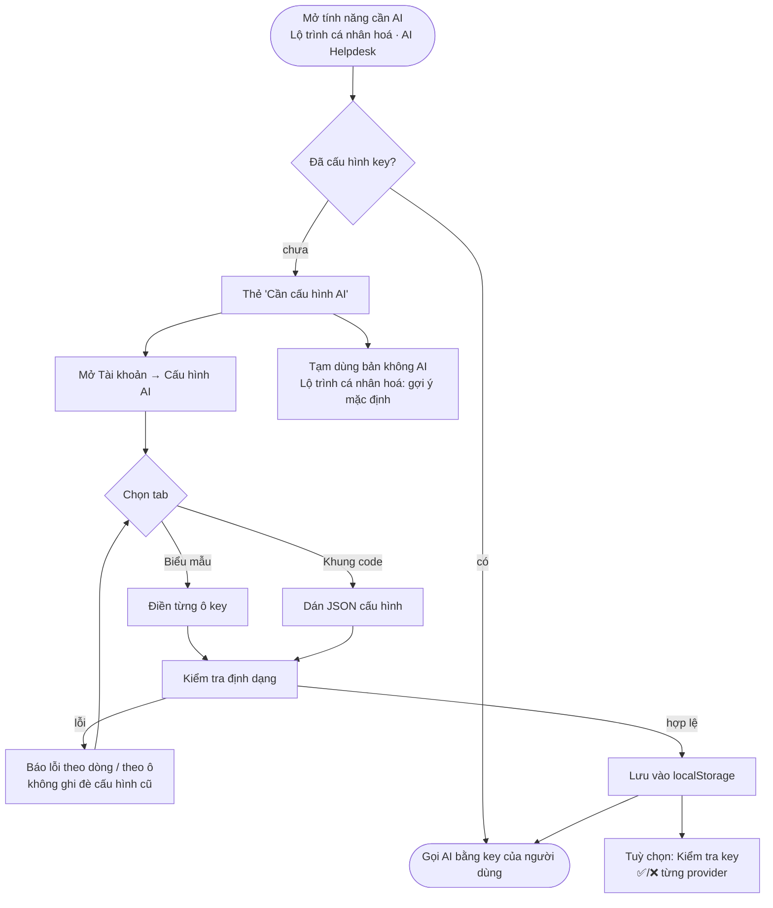

# 07 — Kế hoạch: bỏ Free/Pro, thay bằng menu "Cấu hình AI" (tự mang key)

> Lập 17/9. Người quyết định: `@Khoa`. Làm **sau khi nộp CP3** (16:00 · 17/9), trên branch riêng.
> Phần Tài khoản/Pro đang là 🎭 Mock, **không thuộc lát cắt dự thi**.

## 1. Quyết định đã chốt

| # | Quyết định |
|---|---|
| Q1 | **Bỏ phân loại Free / Pro.** Tính năng không cần AI: ai cũng dùng. Tính năng cần AI: mở khi người dùng **đã cấu hình ít nhất một API key**. |
| Q2 | **Không bán gói AI.** Server không giữ key để gọi thay người dùng. Mọi lời gọi AI đi bằng key của chính người dùng (BYOK). |
| Q3 | Key FPT AI Factory là **key riêng của nhóm để chạy eval và demo**, không phải dịch vụ cho người dùng. FPT vẫn là một provider trong router, người dùng nào có key FPT cũng dùng được. |
| Q4 | Thêm menu **"Cấu hình AI"** trong trang Tài khoản, có 2 tab dùng chung dữ liệu: **Biểu mẫu** và **Khung code (JSON)**. |

Hệ quả: **không cần** đăng nhập thật, thanh toán, bảng gói hay hạn mức phía server. Key tiếp tục chỉ nằm trên trình duyệt (AGENTS.md bất biến #2).

## 2. Hiện trạng (đã kiểm tra trong code)

| Hạng mục | Thực tế |
|---|---|
| Cờ Pro | `StoredUser.tier` / `plan` trong `localStorage`; `clientStorage.upgradeToPro()` chỉ bật cờ |
| Nơi chặn theo Pro | `app/learning/page.tsx` (wizard lộ trình 4 sprint), `app/page.tsx`, `app-sidebar.tsx`, `main-header.tsx`, `user-profile-editor.tsx`, `account-profile-view.tsx`, `pro-upgrade-card.tsx`, `admin-cockpit-dashboard-view.tsx`, `gamified-skill-tree-view.tsx`, `auth-modal.tsx` (tài khoản demo Pro) |
| Form nhập key | `components/settings/api-key-manager.tsx` (trang `/settings`), viết tay từng provider. **Thiếu Cerebras** dù router có hỗ trợ |
| Danh sách provider | Viết tay ở 6 nơi: `lib/llm/router.ts`, `app/api/chat/route.ts`, `app/api/roadmap/route.ts`, `chat-box.tsx`, `study-planner.tsx`, `api-key-manager.tsx` (và `scripts/run-eval.ts`) |
| Thứ tự thử provider | Cố định trong `DEFAULT_PRIORITY` của router |

## 3. Luồng người dùng



## 4. Thiết kế menu "Cấu hình AI"

### 4.1 Tab Biểu mẫu

- Mỗi provider một ô `password`, có link lấy key và gợi ý tiền tố (`AIza…`, `sk-…`, `gsk_…`).
- Danh sách ô **sinh từ registry** (mục 4.3), không viết tay. Nhờ vậy có đủ cả Cerebras và FPT.
- Có phần "Thứ tự ưu tiên": kéo thả, hoặc nút lên/xuống, các provider đã có key.

### 4.2 Tab Khung code

Format:

```json
{
  "priority": ["fpt", "gemini", "openai"],
  "keys": {
    "fpt": "sk-...",
    "gemini": "AIza...",
    "openai": "(đã lưu)"
  }
}
```

| Quy tắc | Lý do |
|---|---|
| Key đã lưu hiện thành `"(đã lưu)"`, **không hiện key thật** | Nhóm quay video và chia sẻ màn hình khi pitch; hiện key dạng chữ thường là lộ |
| Giữ `"(đã lưu)"` khi lưu = giữ key cũ. Dán key mới = thay. Xoá dòng = xoá key | Sửa một key không phải dán lại tất cả |
| `keys` chỉ nhận id có trong registry; sai tên thì gợi ý tên gần nhất (`gemnii` → `gemini`) | Tránh lưu key "chết" mà người dùng tưởng đang chạy |
| `priority` không bắt buộc. Thiếu thì dùng thứ tự mặc định. Có id chưa có key thì cảnh báo, không chặn | Dễ dùng, không bắt học format |
| JSON hỏng hoặc sai schema → **không lưu**, báo lỗi kèm số dòng, giữ nguyên cấu hình cũ | Không để người dùng mất key vì gõ nhầm dấu phẩy |
| Tự bỏ khoảng trắng thừa và key rỗng | Lỗi dán hay gặp |
| Nút "Sao chép mẫu", "Định dạng lại" | Người mới bắt đầu nhanh |
| Dùng `textarea` font mono có số dòng, hoặc CodeMirror 6 bản rút gọn. **Không dùng Monaco** | Monaco nặng vài MB cho một khung nhỏ |

Hai tab đọc và ghi cùng một object. Chuyển tab thì dữ liệu đang sửa (chưa lưu) được giữ nguyên. Nếu JSON đang lỗi thì không cho chuyển tab, tránh mất dữ liệu.

### 4.3 Registry provider — một nguồn duy nhất

`src/lib/llm/providers.ts` (mới):

```ts
export const LLM_PROVIDERS = [
  { id: 'gemini', label: 'Google Gemini', header: 'x-gemini-key', keyHint: 'AIza…', signupUrl: 'https://aistudio.google.com/apikey' },
  // openai, claude, deepseek, groq, cerebras, fpt
] as const;
export type LlmProviderId = (typeof LLM_PROVIDERS)[number]['id'];
```

Các nơi dùng registry thay cho danh sách viết tay:
- `router.ts`: `ADAPTERS`, thứ tự mặc định.
- `app/api/chat/route.ts`, `app/api/roadmap/route.ts`: một hàm chung `readKeysFromHeaders(req)`.
- `chat-box.tsx`, `study-planner.tsx`: một hàm chung `buildKeyHeaders(config)`.
- Menu Cấu hình AI (cả 2 tab).
- `scripts/run-eval.ts`.

### 4.4 Thứ tự ưu tiên

- Client gửi thêm header `x-llm-priority: fpt,gemini,openai`.
- Server chỉ nhận các id có trong registry và có key trong request; id lạ thì bỏ qua. Không có header thì dùng thứ tự mặc định.
- `routeLLMRequest` nhận thêm tham số `priority`.

### 4.5 Kiểm tra key (tuỳ chọn)

- `POST /api/llm/test-key`: nhận đúng một key qua header, gọi provider một lần với prompt rất ngắn, trả `{ ok, provider, error? }`.
- Không lưu, không log key (bất biến #2). Validate body bằng zod (bất biến #6).
- Giới hạn tần suất đơn giản theo IP để route không bị dùng làm proxy thử key.

### 4.6 Lưu trữ

- Giữ `localStorage`. Đổi `StoredApiKeys` thành `{ version: 2, priority: string[], keys: Record<LlmProviderId, string> }`.
- Có hàm chuyển đổi tự động từ bản cũ (object phẳng) để người đang có key không bị mất.
- Không đưa key lên URL, không đồng bộ lên server hay tài khoản.

## 5. Bỏ Free/Pro

| Chỗ | Đổi thành |
|---|---|
| `isPro` (`learning/page.tsx`, `app/page.tsx`) | `hasAiKey` = `clientStorage.hasAnyApiKey()` |
| `pro-upgrade-card.tsx` | `ai-setup-card.tsx`: "Cần cấu hình AI" → nút mở Cấu hình AI · nút dùng bản không AI |
| Nhãn "Pro" (`app-sidebar.tsx`, `main-header.tsx`) | Nhãn "Cần AI" |
| `user-profile-editor.tsx`, `account-profile-view.tsx` | Bỏ "Gói Pro / Free". Thay bằng "Nguồn AI: N provider đã cấu hình" + link mở menu |
| Xoá | `upgradeToPro()`, giá trị `'Pro'` / `'pro'` trong `tier` / `plan`, tài khoản demo Pro trong `auth-modal.tsx`, nút bật Pro trong `admin-cockpit` và `main-header` |
| `/settings` | Chuyển hướng sang Tài khoản → Cấu hình AI, hoặc dùng chung component |

`tier` / `plan` còn được backend .NET trả về (chưa tích hợp). Giữ kiểu `'Admin'` cho quyền quản trị; bỏ `'Pro'`.

## 6. Giai đoạn và phân công

| Giai đoạn | Việc | Phụ trách | Hỗ trợ |
|---|---|---|---|
| **P1 · Registry** | `providers.ts`; `readKeysFromHeaders`, `buildKeyHeaders`; thay 7 nơi viết tay; test | `@Minh` | `@Duc` |
| **P2 · Menu Cấu hình AI** | Tab Biểu mẫu + tab JSON; schema zod + chuyển đổi bản cũ; mục mới trong Tài khoản; `/settings` trỏ về | `@Thanh` | `@Minh` |
| **P3 · Thứ tự ưu tiên** | Header `x-llm-priority`; router nhận `priority`; test | `@Minh` | — |
| **P4 · Bỏ Free/Pro** | Bảng mục 5 | `@Thanh` | `@Khoa` |
| **P5 · Kiểm tra key** (tuỳ chọn) | `/api/llm/test-key` + nút trên menu | `@Minh` | `@Thanh` |
| **P6 · Tài liệu** | `docs/02-kien-truc.md`, `docs/03-api.md` (header `x-fpt-key`, `x-llm-priority`, `/api/llm/test-key`), README bảng trạng thái, `spec.md` §9 | `@Khoa` | — |

Thứ tự làm: P1 → (P2, P3 song song) → P4 → P5 → P6. Mỗi giai đoạn một PR.

Test bắt buộc:
- JSON hỏng → không ghi đè cấu hình cũ.
- `"(đã lưu)"` → giữ key cũ.
- Bản cũ trong `localStorage` được chuyển đổi đúng.
- Id provider lạ trong `x-llm-priority` bị bỏ qua.
- Không log nào chứa key.
- `npm run verify` xanh.

## 7. Rủi ro

| Rủi ro | Chặn bằng |
|---|---|
| Lộ key khi quay màn hình | Khung code không bao giờ hiện key thật; ô biểu mẫu là `password` |
| Mất key vì dán JSON lỗi | Validate trước khi lưu; lỗi thì giữ nguyên cấu hình cũ |
| Người dùng cũ mất key khi đổi format | Hàm chuyển đổi bản cũ + test |
| `/api/llm/test-key` bị lạm dụng | Chỉ nhận một key, không lưu, giới hạn tần suất |
| Key trong `localStorage` bị đọc nếu trang dính XSS | Giữ bất biến #9 (không `dangerouslySetInnerHTML`); ghi rõ trong FAQ rằng key nằm trên máy người dùng |
| Lan sang lát cắt thi sát hạn | Chỉ bắt đầu sau khi nộp CP3; không đổi hành vi `/api/roadmap` ngoài phần đọc header |
