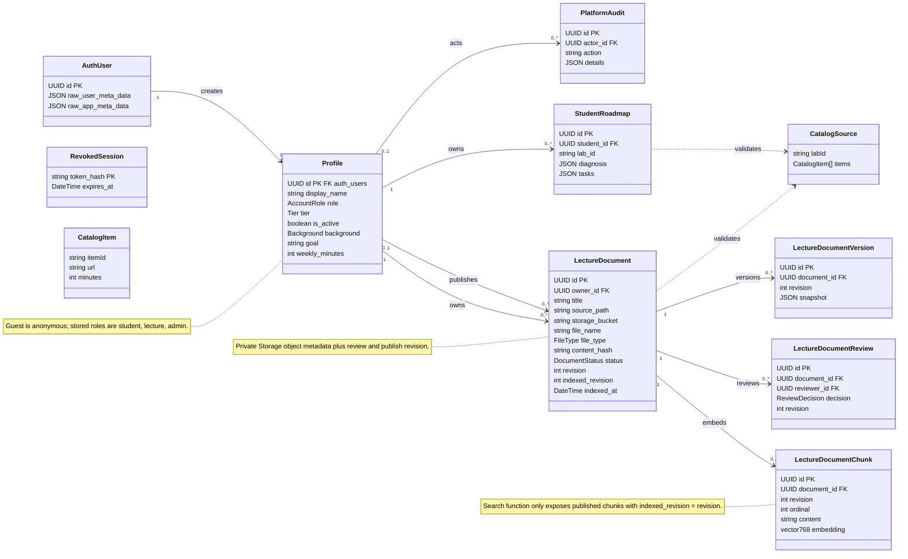

# Class diagram database 4 role

Nguồn schema: migration `0015`–`0019`. `CatalogSource` và `CatalogItem` là allowlist TypeScript, không phải bảng database.

```mermaid
classDiagram
    direction LR

    class AuthUser {
        UUID id PK
        JSON raw_user_meta_data
        JSON raw_app_meta_data
    }
    class Profile {
        UUID id PK FK auth_users
        string display_name
        AccountRole role
        Tier tier
        boolean is_active
        Background background
        string goal
        int weekly_minutes
    }
    class LectureDocument {
        UUID id PK
        UUID owner_id FK
        string title
        string source_path
        string storage_bucket
        string file_name
        FileType file_type
        string content_hash
        DocumentStatus status
        int revision
        int indexed_revision
        DateTime indexed_at
    }
    class LectureDocumentChunk {
        UUID id PK
        UUID document_id FK
        int revision
        int ordinal
        string content
        vector768 embedding
    }
    class LectureDocumentReview {
        UUID id PK
        UUID document_id FK
        UUID reviewer_id FK
        ReviewDecision decision
        int revision
    }
    class LectureDocumentVersion {
        UUID id PK
        UUID document_id FK
        int revision
        JSON snapshot
    }
    class StudentRoadmap {
        UUID id PK
        UUID student_id FK
        string lab_id
        JSON diagnosis
        JSON tasks
    }
    class PlatformAudit {
        UUID id PK
        UUID actor_id FK
        string action
        JSON details
    }
    class RevokedSession {
        string token_hash PK
        DateTime expires_at
    }
    class CatalogSource {
        string labId
        CatalogItem[] items
    }
    class CatalogItem {
        string itemId
        string url
        int minutes
    }

    AuthUser "1" --> "1" Profile : creates
    Profile "1" --> "0..*" LectureDocument : owns
    Profile "0..1" --> "0..*" LectureDocument : publishes
    LectureDocument "1" --> "0..*" LectureDocumentChunk : embeds
    LectureDocument "1" --> "0..*" LectureDocumentReview : reviews
    LectureDocument "1" --> "0..*" LectureDocumentVersion : versions
    Profile "1" --> "0..*" StudentRoadmap : owns
    Profile "0..1" --> "0..*" PlatformAudit : acts
    StudentRoadmap ..> CatalogSource : validates
    LectureDocument ..> CatalogSource : validates

    note for Profile "Guest is anonymous; stored roles are student, lecture, admin."
    note for LectureDocument "Private Storage object metadata plus review and publish revision."
    note for LectureDocumentChunk "Search function only exposes published chunks with indexed_revision = revision."
```
