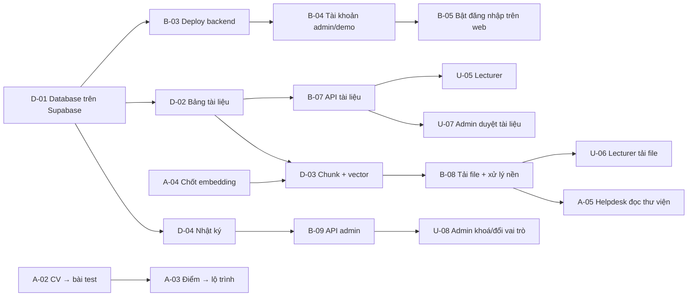

# Giao việc: xây hệ thống 4 vai trò

> Cập nhật: 18/9 (chia lại giao diện/AI lúc 12:48–12:55 theo thống nhất trên Discord) · Người giao: `@Khoa` (PM).
> File này giao việc **xây sản phẩm** (backend, database, giao diện, AI). Việc nộp checkpoint, slide và thuyết trình vẫn ở [`tasks.md`](tasks.md).
> Mỗi task có một GitHub Issue (bấm số `#` cạnh mã task), gom trong milestone [Hệ thống 4 vai trò](https://github.com/Dokhacgiakhoa/K4-3A-e403-Vinonymus/milestone/7). Việc của bạn: tab Issues → **Assigned to me**. Xong task thì đóng issue bằng PR (`Closes #số` trong mô tả PR).
> **Hạn chót tất cả task: 21:00 · 18/9.** Cột "Hạn" là giờ nội bộ hôm nay, đã xếp theo thứ tự phụ thuộc và chừa giờ nộp CP5, thuyết trình CP6 — xem mục 8.
> Trạng thái: ⬜ chưa làm · 🔄 đang làm · ✅ xong · ⛔ bị chặn (ghi lý do ở cột Ghi chú).

## 1. Phân vai

| Mảng | Phụ trách | Làm gì | Không làm |
|---|---|---|---|
| **Backend** (.NET) + **giao diện Student, Viewer** | `@Khoa` | API trong `codebase/backend-core/` theo Clean Architecture; màn hình cho học viên và khách | — |
| **Database** | `@Minh` | Bảng, migration, dữ liệu mẫu, index trong `codebase/database/` | API, đăng nhập, code TypeScript phía server |
| **AI Helpdesk + giao diện Admin, Lecturer** | `@Duc` | AI Helpdesk (chatbox, thư viện tài liệu), màn hình Admin và Lecturer | Gọi LLM ngoài `lib/llm/router.ts`; gọi thẳng database |
| **AI Mentor** | `@Thanh` | AI Mentor: lộ trình, bài test từ CV, golden set, chống lệnh trong dữ liệu | Gọi LLM ngoài `lib/llm/router.ts`; tự viết logic phân quyền |

**Stack đã chốt:** backend **.NET 10** (Clean Architecture + CQRS) · database **PostgreSQL** (host trên Supabase, chỉ dùng làm database) · giao diện **Next.js**. Không thêm backend thứ hai (TypeScript API hay Supabase Auth). Cần đổi stack thì hỏi `@Khoa` trước.

**4 vai trò trong hệ thống:**

| Vai trò | Tên trong backend (`UserRole`) | Được làm gì |
|---|---|---|
| Viewer — khách chưa đăng nhập | (không có tài khoản) | Xem giới thiệu, danh mục lab; hỏi AI Helpdesk 10 câu/ngày |
| Student — học viên | `Visitor`, `Member` | AI Helpdesk không giới hạn + Lộ trình cá nhân hoá |
| Lecturer — giảng viên | `Lecture` | Tải tài liệu lên để AI Mentor đọc vào thư viện |
| Admin | `SuperAdmin` | Duyệt tài khoản, duyệt tài liệu, khoá/đổi vai trò |

## 2. Cách làm việc (bắt buộc)

1. **Mỗi task một nhánh:** `feat/<mã-task>-<tên-ngắn>`, ví dụ `feat/D-02-lecturer-documents`.
2. **Xong task nào commit task đó.** Commit message tiếng Anh, có mã task: `feat(db): add lecturer document tables (D-02)`. **Không** dồn nhiều task, trăm file, hàng chục nghìn dòng vào một commit hay một PR — không ai review được.
3. **Mỗi PR có `PR.md`** ở gốc repo (mẫu: `.claude/skills/pr-md/SKILL.md`). Không push thẳng vào `main`.
4. **Kiểm tra trước khi push:** giao diện/AI chạy `cd codebase && npm run verify`; backend chạy `cd codebase/backend-core && dotnet test` (CI cũng chạy lại ở job `backend-test`). Ghi kết quả thật vào `PR.md`.
5. **Xong task:** đổi trạng thái trong file này ngay trong PR của task đó.
6. Task bị chặn vì chờ người khác: ghi ⛔ và mã task đang chờ, báo trong nhóm. Không tự làm hộ phần của mảng khác.

---

## 3. Backend — `@Khoa`

| ID | Việc | Phụ thuộc | Xong khi | Hạn | Trạng thái |
|---|---|---|---|---|---|
| B-01 [#73](https://github.com/Dokhacgiakhoa/K4-3A-e403-Vinonymus/issues/73) | Chuyển backend về đúng Clean Architecture: nghiệp vụ ở `Application` (CQRS, MediatR, FluentValidation), EF Core và JWT ở `Infrastructure`, `WebApi` chỉ nhận request | — | Build sạch; đường dẫn và dạng JSON trả về không đổi | — | ✅ |
| B-02 [#74](https://github.com/Dokhacgiakhoa/K4-3A-e403-Vinonymus/issues/74) | Test cho B-01: unit test các use case + test tích hợp gọi HTTP thật (`WebApplicationFactory`) | B-01 | `dotnet test` qua, có test luồng đăng ký → chờ duyệt → duyệt → đăng nhập | — | ✅ 60 test |
| B-03 [#75](https://github.com/Dokhacgiakhoa/K4-3A-e403-Vinonymus/issues/75) | Chọn nơi chạy backend thay Railway, deploy bằng Dockerfile có sẵn, nối database Postgres trên Supabase | D-01 | `GET /api/v1/health` trả `healthy` từ địa chỉ thật | 14:15 | ⬜ |
| B-04 [#76](https://github.com/Dokhacgiakhoa/K4-3A-e403-Vinonymus/issues/76) | Tài khoản admin đầu tiên và tài khoản demo cho giám khảo — tạo bằng lệnh vận hành, **không** để mật khẩu trong repo | B-03, D-01 | Đăng nhập được trên web thật; cách tạo ghi trong `docs/06-backend-dotnet.md` | 14:45 | ⬜ |
| B-05 [#77](https://github.com/Dokhacgiakhoa/K4-3A-e403-Vinonymus/issues/77) | Nối Vercel với backend: đặt `NEXT_PUBLIC_BACKEND_CORE_URL`, bật chốt đăng nhập | B-03, B-04 | Khách bị giới hạn 10 câu; Student mở được `/personalized-path` | 20:15 | ⬜ |
| B-06 [#78](https://github.com/Dokhacgiakhoa/K4-3A-e403-Vinonymus/issues/78) | Giới hạn số lần thử đăng ký/đăng nhập (ASP.NET Rate Limiter) | B-01 | Gửi dồn dập bị trả 429, có test | 13:45 | ⬜ |
| B-07 [#79](https://github.com/Dokhacgiakhoa/K4-3A-e403-Vinonymus/issues/79) | API tài liệu giảng viên: tạo nháp → gửi duyệt → admin duyệt → xuất bản → thu hồi; không tự duyệt tài liệu của mình | D-02 | Có test cho từng bước và trường hợp tự duyệt bị chặn | 16:30 | ⬜ |
| B-08 [#80](https://github.com/Dokhacgiakhoa/K4-3A-e403-Vinonymus/issues/80) | API tải file tài liệu (PDF, TXT, MD) + xử lý nền: tách đoạn, tạo embedding, lưu vào thư viện | B-07, D-03, A-04 | File tải lên xuất hiện trong kết quả tìm kiếm của thư viện | 20:00 | ⬜ |
| B-09 [#81](https://github.com/Dokhacgiakhoa/K4-3A-e403-Vinonymus/issues/81) | API admin: khoá/mở tài khoản, đổi vai trò, xem nhật ký thao tác | D-04 | Có test; admin không tự khoá hay tự hạ quyền mình | 15:30 | ⬜ |
| B-10 [#82](https://github.com/Dokhacgiakhoa/K4-3A-e403-Vinonymus/issues/82) | Tài liệu API (OpenAPI/Swagger) để nhóm giao diện đọc | B-01 | Mở được trang tài liệu API khi chạy ở máy | 21:00 | ⬜ |
| B-11 [#83](https://github.com/Dokhacgiakhoa/K4-3A-e403-Vinonymus/issues/83) | CI trên GitHub chạy build + `dotnet test` cho backend ở mọi PR vào `main` (job `backend-test` trong `.github/workflows/verify.yml`) | B-02 | Job `backend-test` xanh trên PR | — | ✅ |

## 4. Database — `@Minh`

> Migration mới đặt trong `codebase/database/migrations/` theo mẫu tên có sẵn (`YYYYMMDD_mo_ta.sql`). Mỗi migration chạy lại nhiều lần không lỗi (`IF NOT EXISTS`). Đặt tên bảng/cột `snake_case` khớp EF Core (`UseSnakeCaseNamingConvention`).
> PR #69 **không merge nguyên trạng** vì dựng backend TypeScript + Supabase Auth song song với .NET. Phần thiết kế database trong đó (tài liệu giảng viên, lịch sử phiên bản, duyệt, nhật ký, pgvector) được tách sang các task D-02 → D-04 dưới đây.

| ID | Việc | Phụ thuộc | Xong khi | Hạn | Trạng thái |
|---|---|---|---|---|---|
| D-01 [#84](https://github.com/Dokhacgiakhoa/K4-3A-e403-Vinonymus/issues/84) | Dựng database cho backend .NET trên Supabase: chạy các migration trong `codebase/database/migrations/` lên project Supabase; tạo tài khoản database riêng cho backend (không dùng tài khoản quản trị); đề xuất tách schema riêng để không lẫn với bảng FAQ/RAG đang có | — | `@Khoa` duyệt đề xuất; backend kết nối và đọc được bảng `users` | 13:30 | ⬜ |
| D-02 [#85](https://github.com/Dokhacgiakhoa/K4-3A-e403-Vinonymus/issues/85) | Bảng tài liệu giảng viên: `lecture_documents`, lịch sử phiên bản, lịch sử duyệt (lấy thiết kế từ PR #69, đổi sang Postgres thuần, bỏ phần Supabase Auth) | D-01 | Migration chạy được; sơ đồ database cập nhật | 14:45 | ⬜ |
| D-03 [#86](https://github.com/Dokhacgiakhoa/K4-3A-e403-Vinonymus/issues/86) | Lưu nội dung tài liệu cho AI Mentor đọc: bảng đoạn văn (chunk) + cột vector (pgvector) + index tìm kiếm | D-02, A-04 (chốt số chiều vector) | Truy vấn tìm 5 đoạn gần nhất chạy được trên dữ liệu mẫu | 16:15 | ⬜ |
| D-04 [#87](https://github.com/Dokhacgiakhoa/K4-3A-e403-Vinonymus/issues/87) | Nhật ký thao tác (ai làm gì, lúc nào) cho duyệt tài khoản và tài liệu | D-01 | Migration chạy được; có index theo thời gian | 14:00 | ⬜ |
| D-05 [#88](https://github.com/Dokhacgiakhoa/K4-3A-e403-Vinonymus/issues/88) | Dữ liệu mẫu: chuyên đề + bài học khớp catalog lab hiện có; kiểm tra lại 3 file seed đang có, bỏ phần trùng | D-01 | Seed chạy trên database trống không lỗi, chạy lần 2 không nhân đôi dữ liệu | 15:30 | ⬜ |
| D-06 [#89](https://github.com/Dokhacgiakhoa/K4-3A-e403-Vinonymus/issues/89) | Cập nhật sơ đồ database (`docs/diagrams/database-class-diagram.mmd`) theo đúng các bảng đang có | D-02 → D-04 | Sơ đồ khớp migration | 19:30 | ⬜ |

## 5. Giao diện — `@Khoa` (Student, Viewer) · `@Duc` (Admin, Lecturer)

> **Mỗi vai trò một giao diện riêng**, hiển thị đúng tính năng của vai trò đó: Viewer (giới thiệu, AI Helpdesk có hạn mức) · Student (Lộ trình cá nhân hoá, AI Helpdesk không giới hạn) · Lecturer (tài liệu của mình) · Admin (duyệt tài khoản, duyệt tài liệu).

> Giao diện chỉ gọi backend qua `codebase/src/lib/api/*`. Quyền thật do backend kiểm tra; giao diện chỉ ẩn/hiện cho đúng vai trò.

| ID | Việc | Phụ trách | Phụ thuộc | Xong khi | Hạn | Trạng thái |
|---|---|---|---|---|---|---|
| U-01 [#90](https://github.com/Dokhacgiakhoa/K4-3A-e403-Vinonymus/issues/90) | Tách giao diện theo 4 vai trò (mỗi vai trò một layout và menu riêng): đọc vai trò từ `GET /api/v1/auth/me`, ánh xạ `Visitor`/`Member` → Student, `Lecture` → Lecturer, `SuperAdmin` → Admin; bỏ cách phân loại cũ Free/Pro/Admin (`tier`, `plan` trong `lib/client-storage.ts`, cờ `isPro` trong `components/layout/app-sidebar.tsx`) | `@Khoa` | — | Mỗi vai trò chỉ thấy giao diện và menu của mình | 19:00 | ⬜ |
| U-02 [#91](https://github.com/Dokhacgiakhoa/K4-3A-e403-Vinonymus/issues/91) | Sửa mục menu "Lộ Trình AI Mentor" trong `app-sidebar.tsx` đang dẫn tới wizard giả (`/learning?mode=ai_roadmap`) → trỏ về `/personalized-path` | `@Khoa` | — | Bấm menu mở đúng tính năng thật | 13:15 | ⬜ |
| U-03 [#92](https://github.com/Dokhacgiakhoa/K4-3A-e403-Vinonymus/issues/92) | Viewer: hiện số câu AI Helpdesk còn lại trong ngày; hết lượt thì mời đăng ký | `@Khoa` | — | Câu thông báo đúng khi còn và khi hết lượt | 20:30 | ⬜ |
| U-04 [#93](https://github.com/Dokhacgiakhoa/K4-3A-e403-Vinonymus/issues/93) | Đăng ký: báo rõ "tài khoản đang chờ duyệt"; đăng nhập bằng tài khoản chờ duyệt/bị từ chối hiện đúng câu backend trả về | `@Khoa` | — | Thử đủ 3 trạng thái: chờ duyệt, bị từ chối, đã duyệt | 20:45 | ⬜ |
| U-05 [#94](https://github.com/Dokhacgiakhoa/K4-3A-e403-Vinonymus/issues/94) | Lecturer: danh sách tài liệu của mình, tạo nháp, gửi duyệt | `@Duc` | B-07 | Làm hết một lượt trên máy với backend chạy thật | 19:00 | ⬜ |
| U-06 [#95](https://github.com/Dokhacgiakhoa/K4-3A-e403-Vinonymus/issues/95) | Lecturer: tải file tài liệu lên, xem trạng thái xử lý | `@Duc` | B-08 | File tải lên chuyển sang "đã xử lý" | 20:30 | ⬜ |
| U-07 [#96](https://github.com/Dokhacgiakhoa/K4-3A-e403-Vinonymus/issues/96) | Admin: màn hình duyệt tài liệu (xem, duyệt, yêu cầu sửa, xuất bản, thu hồi) | `@Duc` | B-07 | Làm hết một lượt với 1 tài liệu mẫu | 19:45 | ⬜ |
| U-08 [#97](https://github.com/Dokhacgiakhoa/K4-3A-e403-Vinonymus/issues/97) | Admin: khoá/mở tài khoản, đổi vai trò, xem nhật ký | `@Duc` | B-09 | Làm hết một lượt; tự khoá mình bị chặn | 16:15 | ⬜ |

## 6. AI — `@Thanh` (AI Mentor) · `@Duc` (AI Helpdesk, thư viện tài liệu)

> Mọi lời gọi LLM đi qua `codebase/src/lib/llm/router.ts`. Đổi prompt nào phải chạy lại golden set và ghi một dòng vào `eval/run_results.md`. Link hiển thị cho học viên chỉ lấy từ catalog.

| ID | Việc | Phụ trách | Phụ thuộc | Xong khi | Hạn | Trạng thái |
|---|---|---|---|---|---|---|
| A-01 [#98](https://github.com/Dokhacgiakhoa/K4-3A-e403-Vinonymus/issues/98) | Sửa các case golden set đang lỗi (xem `eval/run_results.md`), không đổi chuẩn đạt trong `spec.md` §7 | `@Thanh` | — | Số đạt mới ghi vào `eval/run_results.md`, kể cả khi không tăng | 16:15 | ✅ |
| A-02 [#99](https://github.com/Dokhacgiakhoa/K4-3A-e403-Vinonymus/issues/99) | AI Mentor nhiệm vụ 3: đọc CV → sinh bài test năng lực (hiện đang là quy tắc cố định) — thiết kế prompt, schema đầu ra, thêm case vào golden set | `@Thanh` | — | Có ≥5 case eval cho phần này, có số đo thật | 15:30 | ✅ |
| A-03 [#100](https://github.com/Dokhacgiakhoa/K4-3A-e403-Vinonymus/issues/100) | AI Mentor nhiệm vụ 4: điểm bài test → lộ trình lấy tài liệu từ thư viện | `@Thanh` | A-02 | Lộ trình chỉ chứa tài liệu có trong thư viện; có case eval | 19:45 | ✅ |
| A-04 [#101](https://github.com/Dokhacgiakhoa/K4-3A-e403-Vinonymus/issues/101) | Chốt cách đọc tài liệu giảng viên: chia đoạn thế nào, dùng model embedding nào, **bao nhiêu chiều vector** (để Minh làm D-03) | `@Duc` | — | Ghi quyết định vào `docs/04-ai-pipeline.md`; báo `@Minh` và `@Khoa` | 14:00 | ⬜ |
| A-05 [#102](https://github.com/Dokhacgiakhoa/K4-3A-e403-Vinonymus/issues/102) | AI Helpdesk trả lời từ thư viện tài liệu giảng viên (ngoài FAQ đang có), có trích nguồn | `@Duc` | B-08, D-03 | Câu hỏi về tài liệu mới tải lên được trả lời đúng, kèm nguồn | 20:45 | ⬜ |
| A-06 [#103](https://github.com/Dokhacgiakhoa/K4-3A-e403-Vinonymus/issues/103) | Kiểm tra chống "lệnh trong dữ liệu" cho CV và tài liệu tải lên (ví dụ CV có câu "bỏ qua hướng dẫn") | `@Thanh` | A-02, A-05 | Có case eval riêng, AI không làm theo lệnh trong dữ liệu | 21:00 | ⬜ |

---

## 7. Thứ tự nên làm

Việc làm được ngay, không chờ ai: **B-01, B-02, D-01, D-05, U-01 → U-04, A-01, A-02, A-04**.

## 8. Lịch hôm nay (18/9)

Giả định: 12:00–13:00 Khoa và Thành nộp CP5; **16:30–18:30 cả nhóm tập pitch và thuyết trình CP6** (17:30), không làm task. Chậm hạn một task thì báo ngay trong nhóm, vì task sau đang chờ.

| Giờ | Khoa (backend, giao diện Student/Viewer) | Minh (database) | Thành (AI Mentor) | Đức (AI Helpdesk, Admin, Lecturer) |
|---|---|---|---|---|
| 12:00–13:00 | Nộp CP5 | D-01 | Nộp CP5 (video) | A-04 |
| 13:00–14:00 | U-02 (13:15) → B-06 (13:45) | D-01 (13:30) → D-04 | A-02 | A-04 (14:00) |
| 14:00–15:00 | B-03 (14:15) → B-04 (14:45) | D-02 (14:45) | A-02 | Chuẩn bị khung giao diện Admin, Lecturer |
| 15:00–16:30 | B-09 (15:30) → B-07 (16:30) | D-05 (15:30) → D-03 | A-02 (15:30) → A-01 (16:15) | U-08 (16:15) |
| 16:30–18:30 | **Tập pitch + thuyết trình CP6** | ← | ← | ← |
| 18:30–19:30 | U-01 (19:00) → B-08 | D-06 (19:30), rảnh thì hỗ trợ B-08 | A-03 | U-05 (19:00) → U-07 |
| 19:30–20:30 | B-08 (20:00) → B-05 (20:15) → U-03 (20:30) | Hỗ trợ kiểm dữ liệu cho U-05 → U-08 | A-03 (19:45) → A-06 | U-07 (19:45) → U-06 (20:30) |
| 20:30–21:00 | U-04 (20:45) → B-10 (21:00) | Dự phòng | A-06 (21:00) | A-05 (20:45) |

⚠️ **Khoa đang quá tải** (12 task: toàn bộ backend + giao diện Student/Viewer). Nếu trễ, cắt theo thứ tự: B-10 (Swagger) → U-04 → B-06; Minh rảnh buổi tối có thể nhận hỗ trợ B-08.

**Lưu ý thứ tự:** B-05 (bật bắt đăng nhập trên web thật) để **sau** CP6, tránh làm hỏng bản demo trước giờ thuyết trình.

