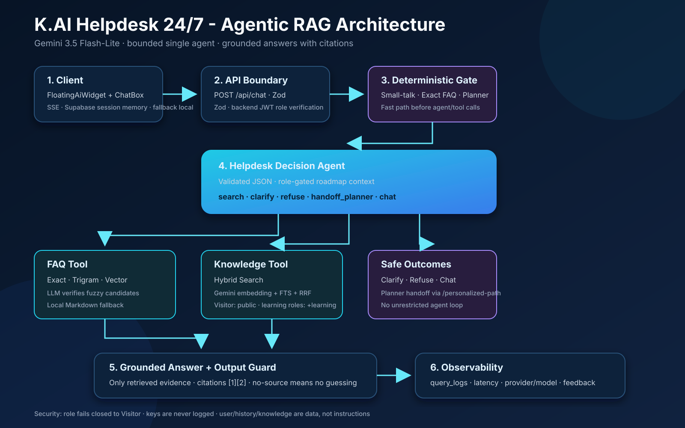
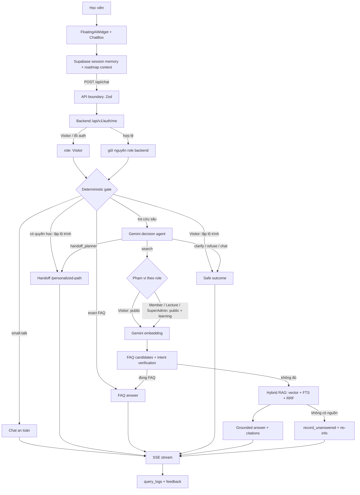

# K.AI Helpdesk 24/7 — kiến trúc Agentic RAG

> Phiên bản: 17/09/2026  
> Trạng thái: triển khai thật, không còn là widget trả lời gán cứng  
> Model điều phối và sinh câu trả lời: `gemini-3.5-flash-lite`  
> Model embedding: `gemini-embedding-001`

## 1. Mục tiêu và phạm vi

K.AI Helpdesk giữ nguyên role do backend cấp: `Visitor`, `Member`, `Lecture` hoặc `SuperAdmin`. FAQ là nội dung công khai. Kho bài học gồm 34 Markdown đã chuẩn hóa từ Day 1–15, gắn `audience: learning`; chỉ `Member`, `Lecture` và `SuperAdmin` được API server truy xuất bằng service role. `Visitor` chỉ truy xuất tài liệu `audience: public`. Tài liệu VLearn gốc và bản chuẩn hóa đều bị Git bỏ qua và không được đưa lên repository.

Chat session được lưu trong Supabase theo guest cookie `HttpOnly` hoặc `user_id` do backend xác thực, tối đa 50 tin; mỗi request chỉ đưa 6 tin gần nhất vào prompt. LocalStorage chỉ là fallback khi database chưa sẵn sàng. `learner_context` không nằm trong memory: UI rút gọn nó từ roadmap `vinonymus_planner_v2`, API kiểm tra schema và chỉ truyền vào agent khi backend xác nhận role khác `Visitor`.

Helpdesk không sửa điểm, deadline hoặc tài khoản; không làm hay nộp bài thay; không thay AI Mentor tạo lộ trình.

## 2. Luồng end-to-end

Thứ tự chạy thật:

0. API dùng `user_id` đã xác thực hoặc guest cookie `HttpOnly` để khôi phục tối đa 6 tin gần nhất từ Supabase; history từ UI chỉ là fallback. UI gửi learner context rút gọn từ roadmap và JWT hiện có. Thiếu token, role lạ hoặc backend lỗi thì fail closed về `Visitor` và loại bỏ learner context.

1. Nhận diện small-talk rõ ràng để tránh tốn quota retrieval.
2. Với yêu cầu lập lộ trình: `Member`, `Lecture` và `SuperAdmin` được chuyển sang `/personalized-path`; `Visitor` được yêu cầu đăng nhập tài khoản học viên.
3. Tìm exact FAQ; nếu trúng thì trả nội dung hoặc dùng Gemini diễn đạt lại.
4. Nếu chưa trúng và không có Gemini key, trả `need_key`.
5. Decision agent chọn đúng một hành động có schema Zod.
6. Với `search`, chọn phạm vi corpus theo role, tạo embedding, thử FAQ candidates rồi Hybrid RAG. `Visitor` dùng anon client; role có quyền học mới dùng service role để đọc cả `learning`.
7. Không có bằng chứng thì ghi câu hỏi chưa trả lời được và không đoán.

## 3. Decision agent

| Hành động | Khi dùng | Kết quả |
|---|---|---|
| `search` | Cần dữ liệu FAQ, lịch, deadline, quy định hoặc kiến thức trong kho | Viết lại câu tra cứu tối đa 500 ký tự rồi gọi retrieval |
| `clarify` | Thiếu bài học, thời gian hoặc đối tượng cần tra | Hỏi lại ngắn gọn |
| `refuse` | Làm bài hộ, sửa điểm/deadline, lấy prompt, bỏ bảo mật hoặc vượt thẩm quyền | Từ chối và gợi ý hành động an toàn |
| `handoff_planner` | Muốn chẩn đoán, lập lịch hoặc tạo lộ trình cá nhân hoá | Trả liên kết `/personalized-path` |
| `chat` | Chào hỏi, cảm ơn hoặc trò chuyện không cần dữ liệu khoá học | Trả lời hội thoại ngắn |

Đầu ra agent là JSON được kiểm tra bởi `helpdeskDecisionSchema`. JSON lỗi, quá 4.000 ký tự hoặc lỗi model sẽ rơi về `search`; không có vòng lặp agent tự do.

## 4. Công cụ

| Công cụ | File chính | Hành vi |
|---|---|---|
| Exact/local FAQ | `lib/rag/faq-match.ts` | Supabase trước, Markdown cục bộ làm fallback |
| FAQ candidates | `lib/rag/faq-match.ts`, `faq-verify.ts` | Trigram/vector rồi Gemini xác minh đúng intent |
| Embedding | `lib/rag/embed.ts` | `gemini-embedding-001`, 768 chiều; lỗi quota thì tiếp tục bằng FTS |
| Knowledge retrieval | `lib/rag/retrieve.ts` | Anon chỉ đọc `public`; service role chỉ được chọn sau xác thực quyền học để đọc thêm `learning`; hybrid fallback FTS |
| Grounded answer | `faq-verify.ts`, `rag-synthesize.ts` | Chỉ dùng knowledge base trong prompt, ghi nguồn `[1]`, `[2]` |
| Escalation dữ liệu | RPC `record_unanswered` | Ghi câu hỏi chưa có nguồn để bổ sung kho tri thức |

Ảnh Markdown do model sinh bị lọc khỏi stream. Prompt buộc dữ kiện và link do model đề xuất phải đến từ nội dung nguồn đã truy xuất; renderer tiếp tục sanitize Markdown. Liên kết nội bộ như `/personalized-path` do hệ thống gắn cứng. Phiên bản hackathon chưa có URL allowlist cứng.

## 5. Hợp đồng API

`POST /api/chat` nhận `question`, `history` và `learner_context` tùy chọn:

- `question`: bắt buộc, sau khi trim còn 1–2.000 ký tự;
- `history`: tối đa 6 tin; role chỉ là `user` hoặc `assistant`; mỗi nội dung tối đa 8.000 ký tự;
- `learner_context`: roadmap rút gọn gồm nền tảng, quỹ thời gian, bài lab, chẩn đoán và tối đa 3 nhiệm vụ; API bỏ trường này với `Visitor`;
- body không được có trường lạ;
- `x-client-session-id` chỉ được dùng khi là UUID hợp lệ;
- `Authorization: Bearer <JWT>` là tùy chọn; role do backend trả về, không nhận từ request body hoặc `localStorage`.

`GET /api/chat` trả tối đa 50 tin của đúng session hiện tại. `DELETE /api/chat` xoá các tin trong session hiện tại. Với guest, API tự cấp cookie `aiia_helpdesk_session` có `HttpOnly`, `SameSite=Lax` và hạn 7 ngày; database chỉ lưu hash của token. Hai bảng memory không có policy cho anon/authenticated, chỉ API server dùng service role.

| SSE event | Ý nghĩa |
|---|---|
| `status` | Trạng thái xử lý hiện tại |
| `token` | Một đoạn câu trả lời đang stream |
| `citations` | Nguồn của nhánh RAG |
| `need_key` | Cần Gemini key để tra cứu sâu |
| `error` | Lỗi công khai đã được làm sạch |
| `done` | Kết thúc, kèm path, provider/model, degraded và `queryLogId` khi có |

## 6. Model và API key

Helpdesk chỉ truyền Gemini key vào LLM router. Thứ tự lấy key:

1. `x-gemini-key` từ trình duyệt;
2. `x-llm-key` để tương thích client cũ;
3. `GEMINI_API_KEY` trong môi trường server/Vercel.

BYOK có thể được lưu trong `localStorage` của chính trình duyệt qua `clientStorage`. Server chỉ dùng key trong phạm vi request, không ghi key vào database, query log hoặc phản hồi. UI không gửi key provider khác tới endpoint Helpdesk.

## 7. An toàn và độ tin cậy

- Zod kiểm tra body tại API boundary và JSON quyết định của model.
- Role được xác thực từ JWT qua backend và không bị đổi tên; không có token, token sai, role lạ hoặc backend lỗi đều fail closed về `Visitor`. `Visitor` không được mở Lộ trình cá nhân hoá hoặc truy xuất corpus `learning`.
- RLS chỉ cho anon đọc document/chunk `audience: public`; đường `learning` dùng service role ở API server sau khi role đã được xác thực.
- Prompt đánh dấu question, history, learner context và knowledge base là dữ liệu, không phải chỉ thị. Learner context chỉ điều chỉnh cách giải thích, không được dùng làm nguồn kiến thức.
- Fast-path small-talk chỉ nhận câu giao tiếp rõ ràng; yêu cầu lấy system prompt không đi đường tắt.
- Agent có năm hành động hữu hạn và quyết định một lần trước retrieval.
- Không có nguồn thì Helpdesk nói chưa có thông tin và ghi `unanswered_questions`.
- Markdown dùng `react-markdown` và `rehype-sanitize`; ảnh từ phản hồi model bị loại.
- Lỗi nội bộ không được trả nguyên văn cho trình duyệt.
- Logging là best-effort: lỗi Supabase không làm hỏng câu trả lời.

## 8. Quan sát và phản hồi

`query_logs` có thể ghi question, 500 ký tự đầu của answer, path, provider/model thực dùng, latency, citations và UUID phiên ẩn danh. Nút 👍/👎 gọi `POST /api/chat/feedback` với `queryLogId`. API key không nằm trong các bản ghi này.

## 9. Chế độ suy giảm

| Tình huống | Hành vi |
|---|---|
| Không có Gemini key | Small-talk, Planner handoff của role có quyền học và exact FAQ vẫn chạy; tra cứu sâu trả `need_key` |
| Không có JWT / JWT sai / backend auth lỗi | Fail closed về `Visitor`; không được mở Lộ trình cá nhân hoá |
| Decision agent lỗi hoặc JSON sai | Chuyển sang `search` |
| Embedding lỗi/quota | Dùng full-text search |
| FAQ synthesis lỗi | Trả nguyên văn FAQ và đánh dấu `degraded` |
| RAG synthesis lỗi hoặc không có nguồn | Không đoán; ghi unanswered và trả hướng dẫn an toàn |
| Query log/feedback lỗi | Câu trả lời vẫn được trả; logging không chặn luồng chính |

## 10. File map và mức hoàn thành

| Khối | File | Trạng thái |
|---|---|---|
| Widget thật | `components/chat/floating-ai-widget.tsx` | Đã gắn `ChatBox` vào layout toàn app |
| Chat UI/SSE | `components/chat/chat-box.tsx` | Đã nối GET/POST/DELETE `/api/chat`, hiển thị tối đa 50 tin và fallback local |
| Session memory | `lib/chat-session-memory.ts`, migration `0022_chat_session_memory.sql` | Supabase là nguồn chính; guest cookie hoặc backend user ID; localStorage fallback |
| Learner context | `lib/learner-context.ts` | Rút gọn roadmap, Zod validate, tách khỏi memory và loại bỏ với `Visitor` |
| API boundary | `app/api/chat/route.ts` | Zod, xác thực role qua backend, key precedence, SSE, logging |
| Access control | `lib/auth/helpdesk-access.ts` | Giữ nguyên role backend; `canAccessLearningFeatures` chỉ suy ra quyền; lỗi → `Visitor` |
| Decision agent | `lib/rag/helpdesk-agent.ts` | 5 actions, structured output, safe fallback |
| Orchestration | `lib/rag/pipeline.ts` | Deterministic gates + agent + FAQ/RAG tools |
| Private corpus | `scripts/prepare-vlearn-markdown.ts`, `scripts/sync-content.ts` | 34 Markdown, bỏ 3 bản trùng + 1 bản hỏng; local-only, `audience: learning` |
| Model | `lib/llm/providers/gemini.ts`, `lib/llm/router.ts` | Gemini 3.5 Flash-Lite qua router chung |
| Test | `tests/unit/learner-context.test.ts`, `helpdesk-access.test.ts`, `retrieve-access.test.ts`, `pipeline.test.ts`, `converse.test.ts`, `stream-text.test.ts` | Roadmap extraction, role gate, tách anon/service role, chặn Visitor khỏi Planner, FAQ, schema, small-talk và stream guard |

## 11. Giới hạn có chủ ý

- Không dùng LangGraph hoặc multi-agent; hiện chỉ cần một quyết định có cấu trúc trước retrieval.
- Session database cần migration `0022_chat_session_memory.sql`; trước khi migration được áp dụng, Helpdesk tự fallback về history/localStorage và không chặn luồng trả lời.
- Tài khoản đăng nhập đồng bộ memory đa thiết bị theo backend `user_id`; guest chỉ tiếp tục được session trên trình duyệt còn cookie, hết hạn sau 7 ngày.
- Chưa tạo session summary; với giới hạn 50 tin và cửa sổ prompt 6 tin, đây là chủ ý cho phạm vi hackathon.
- Learner context lấy từ roadmap cục bộ `vinonymus_planner_v2`; khi roadmap được lưu ở backend, chỉ cần thay nguồn đọc trong `lib/learner-context.ts`.
- Vector RAG và logging phụ thuộc Supabase; local FAQ vẫn dùng khi Supabase lỗi.
- Migration `0021_private_learning_documents.sql` và lượt sync thật phải được áp dụng trên Supabase trước khi corpus Day 1–15 hoạt động ở môi trường triển khai; trước thời điểm đó app chỉ dùng kho đã có.
- Golden set 20 ca của CP3 thuộc AI Mentor/Planner; Helpdesk chỉ duy trì smoke/regression test cho các nhánh chính trước mỗi lần phát hành.
- Helpdesk là tính năng nền, không thay đổi Quality Bar đã khóa của Planner trong `spec.md` §7.

Chỉ cân nhắc state graph khi có nhiều lần gọi tool phụ thuộc nhau; hiện thêm framework agent sẽ tăng độ phức tạp mà không cải thiện lát cắt sử dụng.
