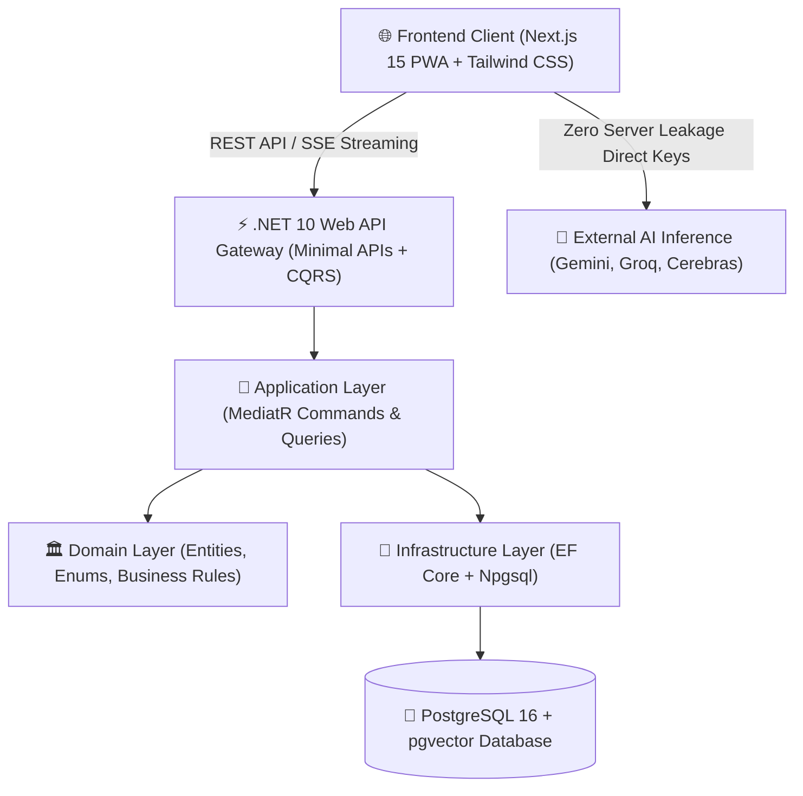

# KIẾN TRÚC CẤU TRÚC THƯ MỤC CHUẨN (ENTERPRISE FOLDER STRUCTURE SPECIFICATION)

> **Dự án**: AI in Action (AI SFIA Engineering & Community Hub)  
> **Phiên bản**: 3.0 (Clean Architecture & Full PascalCase Standard)  
> **Quy chuẩn bất biến**:
> 1. **Toàn bộ tên file C# & TypeScript/React Components**: Bắt buộc dùng **`PascalCase`** (viết liền, viết hoa chữ cái đầu, tuyệt đối không dùng dấu gạch ngang `-`).
> 2. **Từ viết tắt (Acronyms)**: Bắt buộc viết hoa toàn bộ (ví dụ: `SFIA`, `AI`, `PWA`, `VietQR`, `DB`, `RAG`, `CQRS`, `FAQ`).
> 3. **3 Tầng Giao Diện Độc Lập**: Khách vãng lai (`guest/`), Thành viên Free (`free/`), Thành viên Trả phí Pro VIP (`pro/`).

---

## 🗺️ 1. SƠ ĐỒ TỔNG THỂ TOÀN BỘ HỆ THỐNG (SYSTEM OVERVIEW)



---

## 📂 2. CẤU TRÚC CHI TIẾT FRONTEND (`src/`)

```
src/
├── app/                                    # Next.js 15 App Router (Routes & Layouts)
│   ├── layout.tsx                          # Root AppShellLayout Provider
│   ├── page.tsx                            # Root Home Page (Route: /)
│   ├── about/page.tsx                      # Route: /about
│   ├── architecture/page.tsx               # Route: /architecture
│   ├── contact/page.tsx                    # Route: /contact
│   ├── instruction/page.tsx                # Route: /instruction
│   ├── learning/page.tsx                   # Route: /learning (Skill Tree, Roadmap, Curriculum)
│   ├── settings/page.tsx                   # Route: /settings (API Keys Vault, Profile)
│   ├── test/page.tsx                       # Route: /test (SFIA Mock Exams)
│   └── api/                                # Next.js Route Handlers (Edge & Utilities)
│       ├── chat/route.ts                   # Hybrid RAG Streaming Proxy
│       ├── faqs/route.ts                   # Search Knowledge API
│       └── health/route.ts                 # Health Check Endpoint
│
├── components/                             # React 19 / Next.js Components (100% PascalCase)
│   ├── views/                              # 3 Tầng Giao Diện Trải Nghiệm Độc Lập
│   │   ├── guest/                          # 1. Khung Khách Vãng Lai (Guest Landing)
│   │   │   └── GuestHomeView.tsx
│   │   ├── free/                           # 2. Khung Thành Viên Free (Student Workspace)
│   │   │   └── FreeMemberDashboardView.tsx
│   │   └── pro/                            # 3. Khung Thành Viên Trả Phí (Pro Cockpit)
│   │       └── ProCockpitDashboardView.tsx
│   │
│   ├── layout/                             # Bố Cục Toàn Cục & Khung Điều Hướng
│   │   ├── AppShellLayout.tsx              # Điều phối chuyển đổi Guest / Member / Pro
│   │   ├── AppSidebar.tsx                  # Sidebar Trái Phẳng (Thu gọn w-60 <-> w-16)
│   │   ├── MainHeader.tsx                  # Top Header Ngang (Guest & Focus)
│   │   └── MainFooter.tsx                  # Footer Thông Tin & Miễn Trừ Pháp Lý
│   │
│   ├── pages/                              # Named Page Client Components
│   │   ├── HomePageClient.tsx
│   │   ├── LearningPageClient.tsx
│   │   ├── SettingsPageClient.tsx
│   │   ├── ArchitecturePageClient.tsx
│   │   ├── MockTestPageClient.tsx
│   │   ├── InstructionPageClient.tsx
│   │   ├── AboutPageClient.tsx
│   │   └── ContactPageClient.tsx
│   │
│   ├── learning/                           # Không Gian Học Tập & Khảo Thí Năng Lực
│   │   ├── SkillTreeView.tsx               # Cây Kỹ Năng Duolingo SFIA L1 - L4
│   │   ├── DuolingoQuizModal.tsx           # Hộp Thoại Trắc Nghiệm Micro-Quiz Kính Mờ
│   │   ├── FocusModeController.tsx         # Bộ Điều Khiển Chế Độ Deep Work Focus
│   │   ├── AIMentorWizard.tsx              # Khởi Tạo Lộ Trình AI Mentor 1-on-1
│   │   ├── PersonalizedRoadmapView.tsx     # Bảng Điều Khiển 4 Sprints Độc Bản
│   │   ├── StudyAnalyticsDashboard.tsx     # Đồng Hồ 1000h & Thống Kê Screen Time
│   │   └── ProUpgradeCard.tsx              # Thẻ Giới Thiệu Đặc Quyền Pro VIP
│   │
│   ├── chat/                               # Phân Hệ Trợ Lý AI (Hybrid RAG)
│   │   ├── ChatContainer.tsx
│   │   ├── ChatBox.tsx
│   │   ├── ChatSidebar.tsx
│   │   ├── FloatingAIWidget.tsx
│   │   ├── MessageBubble.tsx
│   │   ├── MarkdownRenderer.tsx
│   │   ├── CitationPanel.tsx
│   │   ├── CitationChip.tsx
│   │   ├── FeedbackButtons.tsx
│   │   └── NeedKeyPrompt.tsx
│   │
│   ├── settings/                           # Cài Đặt, Hồ Sơ & Bảo Mật
│   │   ├── ApiKeyManager.tsx               # Két Khóa API AES-256 Vault
│   │   ├── ApiKeyStatusButton.tsx          # Chỉ Báo Trạng Thái Khóa API
│   │   └── UserProfileEditor.tsx           # Thẩm Định Năng Lực (Anti-Vibe Coding)
│   │
│   ├── sfia/                               # Hiển Thị Khung Năng Lực & Giáo Trình
│   │   ├── SFIAMatrixView.tsx
│   │   ├── CurriculumView.tsx
│   │   ├── MockTestsView.tsx
│   │   └── TechStackView.tsx
│   │
│   ├── legal/                              # Pháp Lý & Miễn Trừ Trách Nhiệm
│   │   └── DisclaimerModal.tsx             # Hộp Thoại Tuyên Bố Pháp Lý Glassmorphism
│   │
│   ├── auth/                               # Xác Thực & Phân Quyền
│   │   └── AuthModal.tsx                   # Hộp Thoại Đăng Nhập / Đăng Ký Glassmorphism
│   │
│   └── pwa/                                # Progressive Web App
│       ├── PWAInstallPrompt.tsx
│       ├── PWALoadingScreen.tsx
│       ├── PWAShortcutButton.tsx
│       └── ShortcutGuideView.tsx
│
├── lib/                                    # Thư Viện Tiện Ích & Dịch Vụ Cốt Lõi
│   ├── ClientStorage.ts                    # Quản lý LocalStorage an toàn (Safe Fallback)
│   ├── StudyTimer.ts                       # Bộ đếm giờ 1000h & Heartbeat AFK Detector
│   ├── UseStudyTimer.ts                    # React Hook theo dõi thời gian thực học
│   ├── CleanMarkdown.ts                    # Làm sạch văn bản Markdown
│   ├── VietQRService.ts                    # Sinh mã VietQR chuyển khoản tự động
│   ├── rag/                                # Hybrid RAG Engine (RRF, BM25, Cosine)
│   │   ├── FaqMatch.ts
│   │   ├── FaqVerify.ts
│   │   ├── QueryLog.ts
│   │   ├── RagGeneral.ts
│   │   ├── RagSynthesize.ts
│   │   └── StreamText.ts
│   └── providers/                          # Multi-LLM API Connectors (Client-Side Direct)
│       ├── OpenaiCompatible.ts
│       ├── cerebras.ts
│       ├── deepseek.ts
│       ├── groq.ts
│       ├── openai.ts
│
└── types/                                  # TypeScript Type Definitions
    ├── chat.ts
    ├── database.ts
    ├── faq.ts
    ├── pwa.ts
    ├── study.ts
    └── vietqr.ts
```

---

## 🏛️ 3. CẤU TRÚC CHI TIẾT BACKEND (`backend-core/` — .NET 10 CLEAN ARCHITECTURE)

```
backend-core/
├── AIIANotebook.sln                        # .NET 10 Solution File
│
├── src/
│   ├── Core/
│   │   ├── Domain/                         # 1. DOMAIN LAYER (Enterprise Logic & Entities)
│   │   │   ├── Common/
│   │   │   │   └── BaseEntity.cs           # Id, CreatedAt, UpdatedAt
│   │   │   ├── Entities/
│   │   │   │   ├── AppUser.cs              # Thông tin người dùng & Quotas
│   │   │   │   ├── CurriculumModule.cs     # 12 Modules Giáo trình SFIA 8
│   │   │   │   ├── QuizQuestion.cs         # Ngân hàng câu hỏi trắc nghiệm
│   │   │   │   ├── QuizSubmission.cs       # Lịch sử nộp bài & Điểm số
│   │   │   │   ├── UserStreak.cs           # Chuỗi ngày học Streak & Tổng giờ
│   │   │   │   └── PaymentLedger.cs        # Sổ cái giao dịch nạp tiền VietQR
│   │   │   └── Enums/
│   │   │       ├── SFIALevel.cs            # L1, L2, L3, L4, L5, L6, L7
│   │   │       ├── UserTier.cs             # Guest, Free, Pro
│   │   │       └── PaymentStatus.cs        # Pending, Success, Failed, Refunded
│   │   │
│   │   └── Application/                    # 2. APPLICATION LAYER (Use Cases & CQRS)
│   │       ├── Common/
│   │       │   └── Interfaces/
│   │       │       └── IApplicationDbContext.cs # Database Contract Interface
│   │       └── Features/
│   │           ├── Payments/
│   │           │   ├── CreateVietQRInvoiceCommand.cs # Sinh mã QR & Đơn hàng
│   │           │   └── ApprovePaymentCommand.cs      # Xác thực webhook nạp tiền
│   │           └── Quizzes/
│   │               ├── GetModuleQuizQuery.cs         # Lấy đề thi theo Module
│   │               └── SubmitQuizCommand.cs          # Chấm điểm & Cộng giờ học
│   │
│   ├── Infrastructure/                     # 3. INFRASTRUCTURE LAYER (Data & External IO)
│   │   └── Persistence/
│   │       └── ApplicationDbContext.cs     # EF Core DbContext + PostgreSQL Npgsql
│   │
│   └── WebApi/                             # 4. PRESENTATION LAYER (API Gateway)
│       ├── appsettings.json
│       ├── appsettings.Development.json
│       └── Program.cs                      # Minimal APIs, Rate Limiter, HealthChecks, CORS
│
└── tests/
    └── Domain.UnitTests/                   # 5. AUTOMATED UNIT TESTS (xUnit + FluentAssertions)
        ├── PaymentAuditLedgerUnitTests.cs
        └── QuizSubmissionEvaluationUnitTests.cs
```

---

## 🗄️ 4. CẤU TRÚC CƠ SỞ DỮ LIỆU (`database/`)

```
database/
├── migrations/                             # PostgreSQL DDL Migrations
│   ├── 20260830_commercial_saas_schema.sql # 13 Bảng Core SaaS & Row Level Security (RLS)
│   └── 20260901_sfia_curriculum_tables.sql # Cấu trúc lưu trữ 12 Modules & Mock Tests
│
└── seeds/                                  # Seed Data Khởi Tạo Ban Đầu
    ├── 01_sfia_modules_seed.sql            # 12 Modules chuẩn hóa SFIA 8 (L1 - L4)
    ├── 02_mock_questions_seed.sql          # 100+ Câu hỏi trắc nghiệm mô phỏng độc lập
    └── 03_system_configs_seed.sql          # Cấu hình hạn mức Quota & Tỷ giá gói Pro
```

---

## 🔒 5. NGUYÊN TẮC BẢO TRÌ VÀ PHÁT TRIỂN TIẾP THEO:
1. Mọi component mới trong `src/components/` phải đặt tên dạng **`PascalCase.tsx`** và phản ánh chính xác chức năng (`[Feature][ComponentType].tsx`).
2. Mọi entity, command, query trong `backend-core/` phải đặt tên dạng **`PascalCase.cs`**.
3. Tuyệt đối không tạo lại các file có gạch ngang `-` trong thư mục mã nguồn.
